# Sample file bad_prettydiv.imscr

## Complete file (click expand to see all) [download](./imscr/bad_prettydiv.imscr)

<details><summary>Expand: bad_prettydiv.imscr</summary>

```
<?xml version="1.0" encoding="UTF-8" standalone="yes"?>
<tt xmlns="http://www.w3.org/ns/ttml" xmlns:ttm="http://www.w3.org/ns/ttml#metadata" xmlns:tts="http://www.w3.org/ns/ttml#styling" xmlns:ttp="http://www.w3.org/ns/ttml#parameter" xmlns:xml="http://www.w3.org/XML/1998/namespace" xmlns:ebutts="urn:ebu:tt:style" xmlns:itts="http://www.w3.org/ns/ttml/profile/imsc1#styling" xmlns:rosetta="https://github.com/imsc-rosetta/specification" ttp:timeBase="media" ttp:cellResolution="30 15" xml:space="preserve" ttp:frameRate="25" ttp:frameRateMultiplier="1 1" xml:lang="el-GR">
 <head>
  <metadata>
   <rosetta:format>imsc-rosetta</rosetta:format>
   <rosetta:version>0.0.0</rosetta:version>
  </metadata>
  <styling>
   <style xml:id="r_region" tts:backgroundColor="transparent" tts:showBackground="whenActive" tts:fontStyle="normal" tts:fontWeight="normal" tts:color="white" tts:fontFamily="proportionalSansSerif" tts:textAlign="center" itts:fillLineGap="true" style="_r_default"/>
   <style xml:id="s_italic" tts:fontStyle="italic"/>
   <style xml:id="s_bold" tts:fontWeight="bold"/>
   <style xml:id="s_underline" tts:textDecoration="underline"/>
   <style xml:id="ds_fg_black" tts:color="#000000"/>
   <style xml:id="ds_fg_red" tts:color="#FF0000"/>
   <style xml:id="ds_fg_yellow" tts:color="#FFFF00"/>
   <style xml:id="ds_fg_green" tts:color="#00FF00"/>
   <style xml:id="ds_fg_cyan" tts:color="#00FFFF"/>
   <style xml:id="ds_fg_blue" tts:color="#0000FF"/>
   <style xml:id="ds_fg_magenta" tts:color="#FF00FF"/>
   <style xml:id="ps_bg_boxedblack" tts:backgroundColor="#000000"/>
   <style xml:id="ps_bg_boxedred" tts:backgroundColor="#FF0000"/>
   <style xml:id="ps_bg_boxedyellow" tts:backgroundColor="#FF0000"/>
   <style xml:id="ps_bg_boxedgreen" tts:backgroundColor="#00FF00"/>
   <style xml:id="ps_bg_boxedcyan" tts:backgroundColor="#00FFFF"/>
   <style xml:id="ps_bg_boxedblue" tts:backgroundColor="#0000FF"/>
   <style xml:id="ps_bg_boxedmagenta" tts:backgroundColor="#FF00FF"/>
   <style xml:id="ps_bg_boxedwhite" tts:backgroundColor="#FFFFFF"/>
   <style xml:id="ps_bg_ghostboxedblack" tts:backgroundColor="#00000080"/>
   <style xml:id="ps_bg_ghostboxedred" tts:backgroundColor="#FF000080"/>
   <style xml:id="ps_bg_ghostboxedyellow" tts:backgroundColor="#FFFF0080"/>
   <style xml:id="ps_bg_ghostboxedgreen" tts:backgroundColor="#00FF0080"/>
   <style xml:id="ps_bg_ghostboxedcyan" tts:backgroundColor="#00FFFF80"/>
   <style xml:id="ps_bg_ghostboxedblue" tts:backgroundColor="#0000FF80"/>
   <style xml:id="ps_bg_ghostboxedmagenta" tts:backgroundColor="#FF00FF80"/>
   <style xml:id="ps_bg_ghostboxedwhite" tts:backgroundColor="#FFFFFF80"/>
   <style xml:id="ds_outlineblack" tts:textOutline="#000000 0.05em"/>
   <style xml:id="ds_outlinered" tts:textOutline="#FF0000 0.05em"/>
   <style xml:id="ds_outlineyellow" tts:textOutline="#FFFF00 0.05em"/>
   <style xml:id="ds_outlinegreen" tts:textOutline="#00FF00 0.05em"/>
   <style xml:id="ds_outlinecyan" tts:textOutline="#00FFFF 0.05em"/>
   <style xml:id="ds_outlineblue" tts:textOutline="#0000FF 0.05em"/>
   <style xml:id="ds_outlinemagenta" tts:textOutline="#FF00FF 0.05em"/>
   <style xml:id="ds_outlinewhite" tts:textOutline="#FFFFFF 0.05em"/>
   <style xml:id="ds_dropblack" tts:textOutline="#000000 0.05em"/>
   <style xml:id="ds_dropred" tts:textOutline="#FF0000 0.05em"/>
   <style xml:id="ds_dropyellow" tts:textOutline="#FFFF00 0.05em"/>
   <style xml:id="ds_dropgreen" tts:textOutline="#00FF00 0.05em"/>
   <style xml:id="ds_dropcyan" tts:textOutline="#00FFFF 0.05em"/>
   <style xml:id="ds_dropblue" tts:textOutline="#0000FF 0.05em"/>
   <style xml:id="ds_dropmagenta" tts:textOutline="#FF00FF 0.05em"/>
   <style xml:id="ds_dropwhite" tts:textOutline="#FFFFFF 0.05em"/>
   <style xml:id="ds_noneblack"/>
   <style xml:id="ds_nonered"/>
   <style xml:id="ds_noneyellow"/>
   <style xml:id="ds_nonegreen"/>
   <style xml:id="ds_nonecyan"/>
   <style xml:id="ds_noneblue"/>
   <style xml:id="ds_nonemagenta"/>
   <style xml:id="ds_nonewhite"/>
   <style xml:id="dp_al_start" tts:textAlign="start"/>
   <style xml:id="dp_al_end" tts:textAlign="end"/>
   <style xml:id="dp_al_center" tts:textAlign="center"/>
   <style xml:id="ps_bg_unboxed" tts:backgroundColor="transparent"/>
   <style xml:id="d_forced" itts:forcedDisplay="true"/>
   <style xml:id="p_font1" tts:fontFamily="proportionalSansSerif" tts:lineHeight="125%" tts:fontSize="100%"/>
   <style xml:id="p_font2" tts:fontFamily="proportionalSansSerif" tts:lineHeight="125%" tts:fontSize="100%"/>
   <style xml:id="_d_default" style="ds_outlineblack"/>
   <style xml:id="_s_default"/>
   <style xml:id="_p_default" style="p_font2"/>
   <style xml:id="_r_default" tts:origin="10% 10%" tts:extent="80% 80%" tts:displayAlign="after" tts:fontSize="5.333rh" tts:lineHeight="125%" ebutts:linePadding="0.25c"/>
  </styling>
  <layout>
   <region xml:id="R0" tts:origin="10% 10%" tts:extent="80% 80%" tts:displayAlign="after" style="r_region"/>
   <region xml:id="R1" tts:origin="10% 10%" tts:extent="80% 73.3%" tts:displayAlign="after" style="r_region"/>
   <region xml:id="R2" tts:origin="10% 10%" tts:extent="80% 66.7%" tts:displayAlign="after" style="r_region"/>
   <region xml:id="R3" tts:origin="10% 10%" tts:extent="80% 60%" tts:displayAlign="after" style="r_region"/>
   <region xml:id="R4" tts:origin="10% 10%" tts:extent="80% 53.3%" tts:displayAlign="after" style="r_region"/>
   <region xml:id="R5" tts:origin="10% 10%" tts:extent="80% 46.7%" tts:displayAlign="after" style="r_region"/>
   <region xml:id="R6" tts:origin="10% 43.3%" tts:extent="80% 46.7%" tts:displayAlign="before" style="r_region"/>
   <region xml:id="R7" tts:origin="10% 36.7%" tts:extent="80% 53.3%" tts:displayAlign="before" style="r_region"/>
   <region xml:id="R8" tts:origin="10% 30%" tts:extent="80% 60%" tts:displayAlign="before" style="r_region"/>
   <region xml:id="R9" tts:origin="10% 23.3%" tts:extent="80% 66.7%" tts:displayAlign="before" style="r_region"/>
   <region xml:id="R10" tts:origin="10% 16.7%" tts:extent="80% 73.3%" tts:displayAlign="before" style="r_region"/>
   <region xml:id="R11" tts:origin="10% 10%" tts:extent="80% 80%" tts:displayAlign="before" style="r_region"/>
  </layout>
 </head>
 <body>
  <div xml:id="sub0" region="R0" begin="01:00:03.600" end="01:00:07.640" style="ds_outlineblack">
   <metadata rosetta:comment="this is a comment test a cr"/>
   <p style="p_font2">
    <span style="ps_bg_boxedblack">First Frame of active video </span>
   </p>
  </div>
  <div xml:id="1" region="R0" begin="01:00:07.760" end="01:00:11.760" style="_d_default">
   <p style="p_font2">
    <span>1 line</span>
    <span style="ds_nonered"> Center</span>
    <span> Bottom</span>
   </p>
  </div>
  <div xml:id="2" region="R0" begin="01:00:11.880" end="01:00:15.880" style="_d_default dp_al_start">
   <p style="p_font2">
    <span>1 line left  bottom</span>
   </p>
  </div>
  <div xml:id="3" region="R0" begin="01:00:16.000" end="01:00:20.000" style="_d_default dp_al_end">
   <p style="p_font2">
    <span>1 line right bottom</span>
   </p>
  </div>
  <div xml:id="4" region="R0" begin="01:00:20.120" end="01:00:24.120" style="_d_default">
   <p style="p_font2">
    <span>two line </span>
   </p>
   <p style="p_font2">
    <span>center bottom</span>
   </p>
  </div>
  <div xml:id="5" region="R0" begin="01:00:24.240" end="01:00:28.240" style="_d_default">
   <p style="p_font2">
    <span>two lines</span>
   </p>
   <p style="p_font2">
    <span>left bottom</span>
   </p>
  </div>
  <div xml:id="6" region="R0" begin="01:00:28.360" end="01:00:32.360" style="_d_default">
   <p style="p_font2">
    <span>two lines</span>
   </p>
   <p style="p_font2">
    <span>right bottom</span>
   </p>
  </div>
  <div xml:id="7" region="R0" begin="01:00:32.480" end="01:00:36.480" style="_d_default">
   <p style="p_font2">
    <span>row 11</span>
   </p>
  </div>
  <div xml:id="8" region="R1" begin="01:00:36.640" end="01:00:40.640" style="_d_default">
   <p style="p_font2">
    <span>row 10</span>
   </p>
  </div>
  <div xml:id="9" region="R2" begin="01:00:40.760" end="01:00:44.760" style="_d_default">
   <p style="p_font2">
    <span>row 9</span>
   </p>
  </div>
  <div xml:id="10" region="R3" begin="01:00:44.880" end="01:00:48.880" style="_d_default">
   <p style="p_font2">
    <span>row 8</span>
   </p>
  </div>
  <div xml:id="11" region="R4" begin="01:00:49.000" end="01:00:53.000" style="_d_default">
   <p style="p_font2">
    <span>row 7</span>
   </p>
  </div>
  <div xml:id="12" region="R5" begin="01:00:53.120" end="01:00:57.120" style="_d_default">
   <p style="p_font2">
    <span>row 6</span>
   </p>
  </div>
  <div xml:id="13" region="R6" begin="01:00:57.240" end="01:01:01.240" style="_d_default">
   <p style="p_font2">
    <span>row 5</span>
   </p>
  </div>
  <div xml:id="14" region="R7" begin="01:01:01.360" end="01:01:05.360" style="_d_default">
   <p style="p_font2">
    <span>row 4</span>
   </p>
  </div>
  <div xml:id="15" region="R8" begin="01:01:05.480" end="01:01:09.480" style="_d_default">
   <p style="p_font2">
    <span>row 3</span>
   </p>
  </div>
  <div xml:id="16" region="R9" begin="01:01:09.640" end="01:01:13.640" style="_d_default">
   <p style="p_font2">
    <span>row 2</span>
   </p>
  </div>
  <div xml:id="17" region="R10" begin="01:01:13.760" end="01:01:17.760" style="_d_default">
   <p style="p_font2">
    <span>row 1</span>
   </p>
  </div>
  <div xml:id="18" region="R11" begin="01:01:17.880" end="01:01:21.880" style="_d_default">
   <p style="p_font2">
    <span>row 0</span>
   </p>
  </div>
  <div xml:id="19" region="R11" begin="01:01:22.000" end="01:01:26.000" style="_d_default">
   <p style="p_font2">
    <span>top center</span>
   </p>
  </div>
  <div xml:id="20" region="R11" begin="01:01:26.120" end="01:01:30.120" style="_d_default dp_al_start">
   <p style="p_font2">
    <span>top left</span>
   </p>
  </div>
  <div xml:id="21" region="R11" begin="01:01:30.240" end="01:01:34.240" style="_d_default dp_al_end">
   <p style="p_font2">
    <span>top right</span>
   </p>
  </div>
  <div xml:id="22" region="R0" begin="01:01:34.360" end="01:01:38.360" style="_d_default">
   <p style="dp_al_start p_font2">
    <span>left</span>
   </p>
   <p style="p_font2">
    <span>center</span>
   </p>
   <p style="dp_al_end p_font2">
    <span>right</span>
   </p>
  </div>
  <div xml:id="23" region="R0" begin="01:01:38.520" end="01:01:42.520" style="_d_default">
   <p style="p_font2">
    <span>normal</span>
    <span style="s_italic"> italic</span>
    <span style="s_bold"> bold </span>
    <span style="s_underline">underline</span>
    <span> normal</span>
   </p>
   <p style="p_font2">
    <span style="s_underline">underlined</span>
    <span style="s_italic s_underline"> italic</span>
    <span style="s_bold s_underline"> bold</span>
    <span style="s_underline"> normal</span>
   </p>
  </div>
  <div xml:id="24" region="R0" begin="01:01:42.640" end="01:01:46.640" style="_d_default">
   <p style="p_font2">
    <span style="ds_fg_red">red </span>
    <span style="ds_fg_yellow">yellow </span>
    <span style="ds_fg_green">green </span>
    <span style="ds_fg_cyan">cyan </span>
    <span style="ds_fg_blue">blue </span>
    <span style="ds_fg_magenta">magenta</span>
   </p>
  </div>
  <div xml:id="25" region="R11" begin="01:01:46.760" end="01:01:50.760" style="_d_default">
   <p style="p_font2">
    <span>Two lines </span>
   </p>
   <p style="p_font2">
    <span>top center</span>
   </p>
  </div>
  <div xml:id="26" region="R0" begin="01:01:50.880" end="01:01:53.880" style="_d_default ds_noneblack">
   <p style="p_font2 ps_bg_boxedblack">
    <span>Background stripe</span>
   </p>
   <p style="p_font2 ps_bg_boxedblack">
    <span>black</span>
   </p>
  </div>
  <div xml:id="27" region="R0" begin="01:01:54.000" end="01:01:57.000" style="_d_default">
   <p style="p_font2">
    <span style="ps_bg_boxedblack">black</span>
   </p>
   <p style="p_font2">
    <span style="ps_bg_boxedblack">box</span>
   </p>
  </div>
  <div xml:id="28" region="R0" begin="01:01:57.120" end="01:02:00.120" style="_d_default">
   <p style="p_font2">
    <span style="ps_bg_ghostboxedblack">ghost</span>
   </p>
   <p style="p_font2">
    <span style="ps_bg_ghostboxedblack">box</span>
   </p>
  </div>
  <div xml:id="29" region="R0" begin="01:02:00.240" end="01:02:03.240" style="_d_default ds_noneblack">
   <p style="p_font2 ps_bg_ghostboxedblack">
    <span>Ghost stripe</span>
   </p>
   <p style="p_font2 ps_bg_ghostboxedblack">
    <span>black</span>
   </p>
  </div>
  <div xml:id="30" region="R0" begin="01:02:03.359" end="01:02:06.359" style="_d_default">
   <p style="p_font2">
    <span style="ps_bg_ghostboxedblack">Ghost box change to </span>
    <span style="ps_bg_ghostboxedred ds_nonered">red</span>
   </p>
  </div>
 </body>
</tt>
```

</details>

## Divs with images:


### subtitle sub0 at begin=01:00:03.600

#### div XML

```
<div xml:id="sub0" region="R0" begin="01:00:03.600" end="01:00:07.640" style="ds_outlineblack">
   <metadata rosetta:comment="this is a comment test a cr"/>
   <p style="p_font2">
    <span style="ps_bg_boxedblack">First Frame of active video </span>
   </p>
  </div>
```
#### Resulting Image


### subtitle 1 at begin=01:00:07.760

#### div XML

```
<div xml:id="1" region="R0" begin="01:00:07.760" end="01:00:11.760" style="_d_default">
   <p style="p_font2">
    <span>1 line</span>
    <span style="ds_nonered"> Center</span>
    <span> Bottom</span>
   </p>
  </div>
```
#### Resulting Image

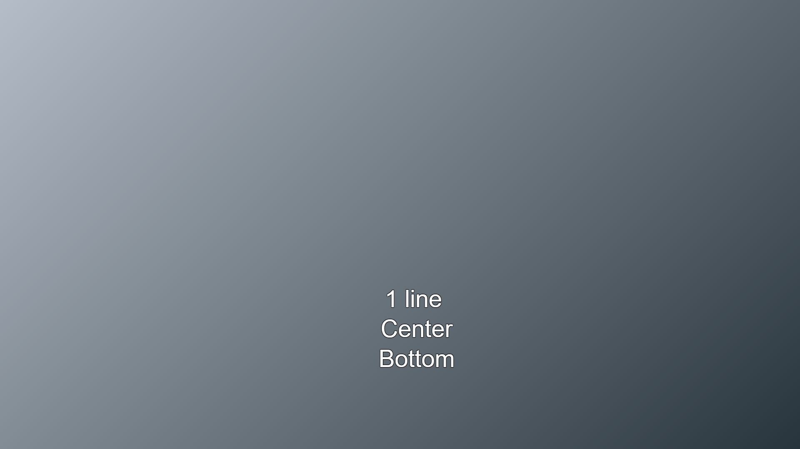


### subtitle 2 at begin=01:00:11.880

#### div XML

```
<div xml:id="2" region="R0" begin="01:00:11.880" end="01:00:15.880" style="_d_default dp_al_start">
   <p style="p_font2">
    <span>1 line left  bottom</span>
   </p>
  </div>
```
#### Resulting Image


### subtitle 3 at begin=01:00:16.000

#### div XML

```
<div xml:id="3" region="R0" begin="01:00:16.000" end="01:00:20.000" style="_d_default dp_al_end">
   <p style="p_font2">
    <span>1 line right bottom</span>
   </p>
  </div>
```
#### Resulting Image


### subtitle 4 at begin=01:00:20.120

#### div XML

```
<div xml:id="4" region="R0" begin="01:00:20.120" end="01:00:24.120" style="_d_default">
   <p style="p_font2">
    <span>two line </span>
   </p>
   <p style="p_font2">
    <span>center bottom</span>
   </p>
  </div>
```
#### Resulting Image

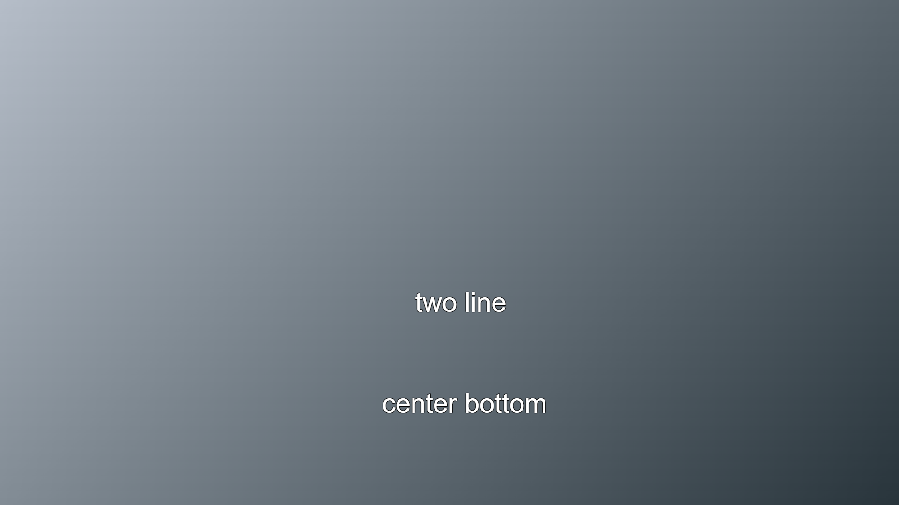


### subtitle 5 at begin=01:00:24.240

#### div XML

```
<div xml:id="5" region="R0" begin="01:00:24.240" end="01:00:28.240" style="_d_default">
   <p style="p_font2">
    <span>two lines</span>
   </p>
   <p style="p_font2">
    <span>left bottom</span>
   </p>
  </div>
```
#### Resulting Image

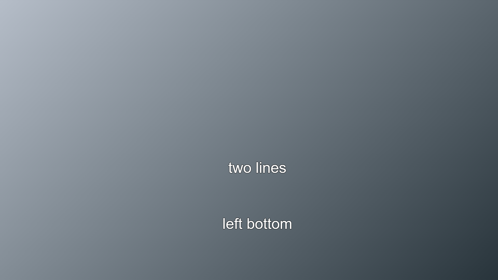


### subtitle 6 at begin=01:00:28.360

#### div XML

```
<div xml:id="6" region="R0" begin="01:00:28.360" end="01:00:32.360" style="_d_default">
   <p style="p_font2">
    <span>two lines</span>
   </p>
   <p style="p_font2">
    <span>right bottom</span>
   </p>
  </div>
```
#### Resulting Image

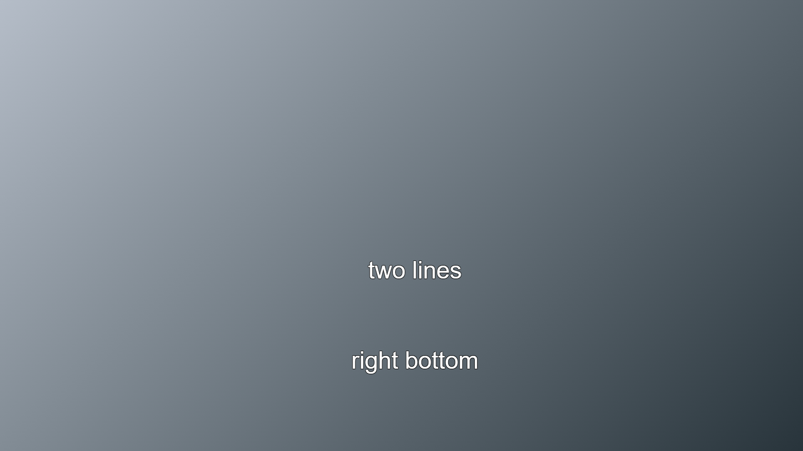


### subtitle 7 at begin=01:00:32.480

#### div XML

```
<div xml:id="7" region="R0" begin="01:00:32.480" end="01:00:36.480" style="_d_default">
   <p style="p_font2">
    <span>row 11</span>
   </p>
  </div>
```
#### Resulting Image

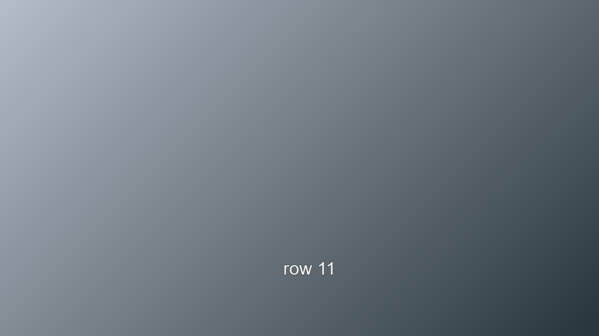


### subtitle 8 at begin=01:00:36.640

#### div XML

```
<div xml:id="8" region="R1" begin="01:00:36.640" end="01:00:40.640" style="_d_default">
   <p style="p_font2">
    <span>row 10</span>
   </p>
  </div>
```
#### Resulting Image

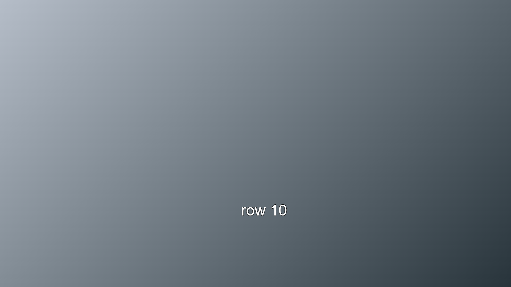


### subtitle 9 at begin=01:00:40.760

#### div XML

```
<div xml:id="9" region="R2" begin="01:00:40.760" end="01:00:44.760" style="_d_default">
   <p style="p_font2">
    <span>row 9</span>
   </p>
  </div>
```
#### Resulting Image


### subtitle 10 at begin=01:00:44.880

#### div XML

```
<div xml:id="10" region="R3" begin="01:00:44.880" end="01:00:48.880" style="_d_default">
   <p style="p_font2">
    <span>row 8</span>
   </p>
  </div>
```
#### Resulting Image

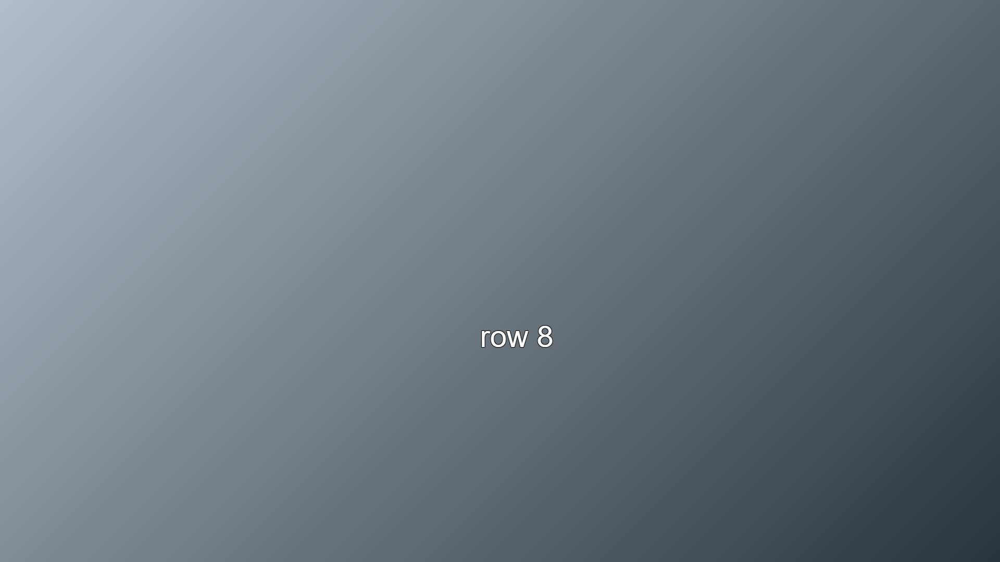


### subtitle 11 at begin=01:00:49.000

#### div XML

```
<div xml:id="11" region="R4" begin="01:00:49.000" end="01:00:53.000" style="_d_default">
   <p style="p_font2">
    <span>row 7</span>
   </p>
  </div>
```
#### Resulting Image

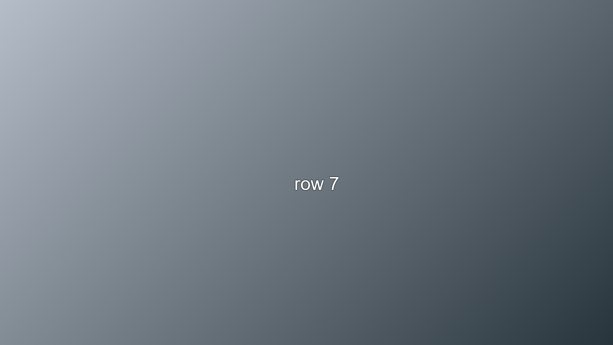


### subtitle 12 at begin=01:00:53.120

#### div XML

```
<div xml:id="12" region="R5" begin="01:00:53.120" end="01:00:57.120" style="_d_default">
   <p style="p_font2">
    <span>row 6</span>
   </p>
  </div>
```
#### Resulting Image


### subtitle 13 at begin=01:00:57.240

#### div XML

```
<div xml:id="13" region="R6" begin="01:00:57.240" end="01:01:01.240" style="_d_default">
   <p style="p_font2">
    <span>row 5</span>
   </p>
  </div>
```
#### Resulting Image


### subtitle 14 at begin=01:01:01.360

#### div XML

```
<div xml:id="14" region="R7" begin="01:01:01.360" end="01:01:05.360" style="_d_default">
   <p style="p_font2">
    <span>row 4</span>
   </p>
  </div>
```
#### Resulting Image

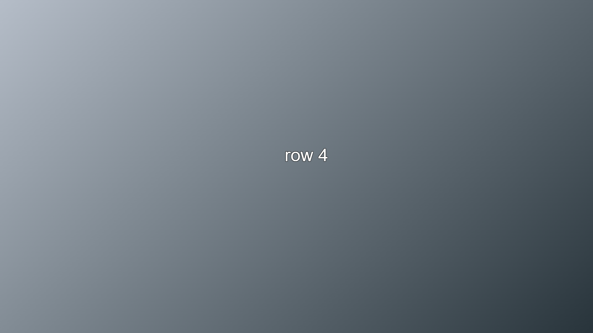


### subtitle 15 at begin=01:01:05.480

#### div XML

```
<div xml:id="15" region="R8" begin="01:01:05.480" end="01:01:09.480" style="_d_default">
   <p style="p_font2">
    <span>row 3</span>
   </p>
  </div>
```
#### Resulting Image

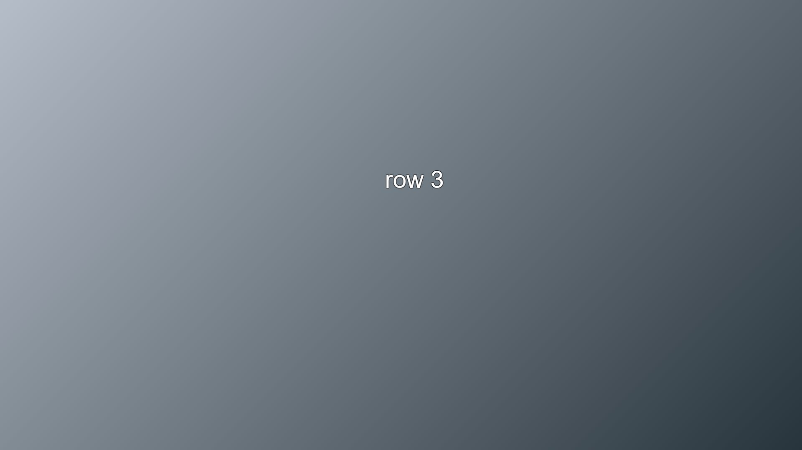


### subtitle 16 at begin=01:01:09.640

#### div XML

```
<div xml:id="16" region="R9" begin="01:01:09.640" end="01:01:13.640" style="_d_default">
   <p style="p_font2">
    <span>row 2</span>
   </p>
  </div>
```
#### Resulting Image

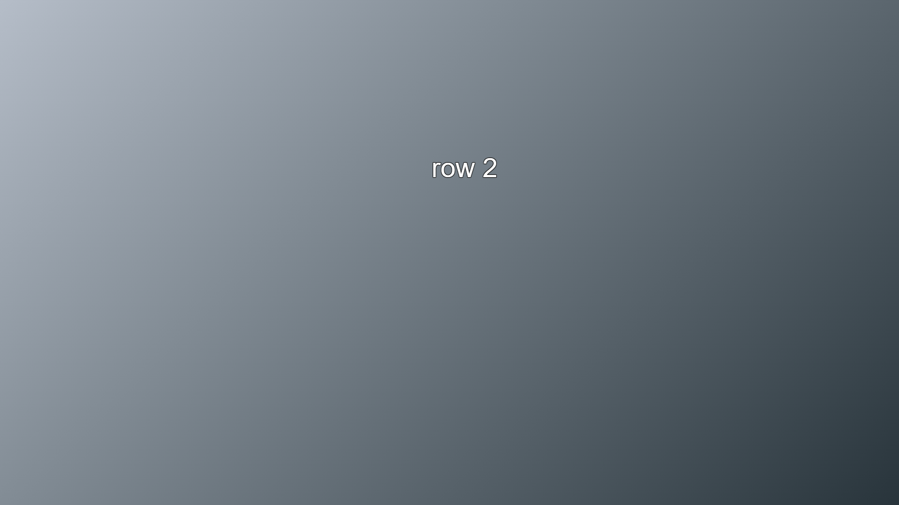


### subtitle 17 at begin=01:01:13.760

#### div XML

```
<div xml:id="17" region="R10" begin="01:01:13.760" end="01:01:17.760" style="_d_default">
   <p style="p_font2">
    <span>row 1</span>
   </p>
  </div>
```
#### Resulting Image

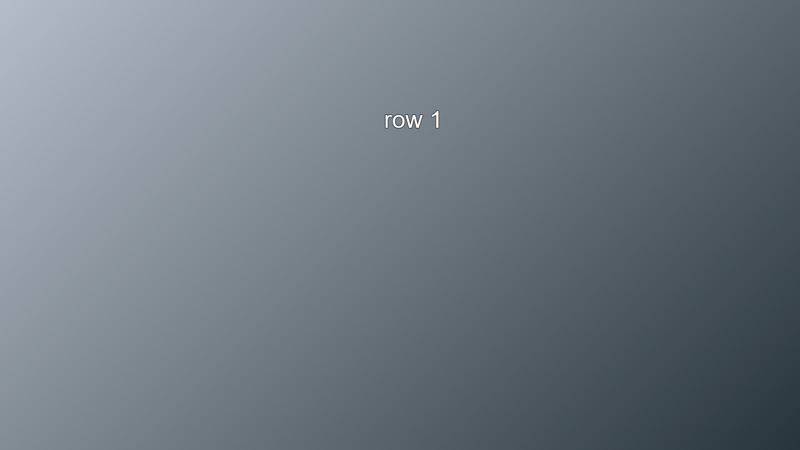


### subtitle 18 at begin=01:01:17.880

#### div XML

```
<div xml:id="18" region="R11" begin="01:01:17.880" end="01:01:21.880" style="_d_default">
   <p style="p_font2">
    <span>row 0</span>
   </p>
  </div>
```
#### Resulting Image

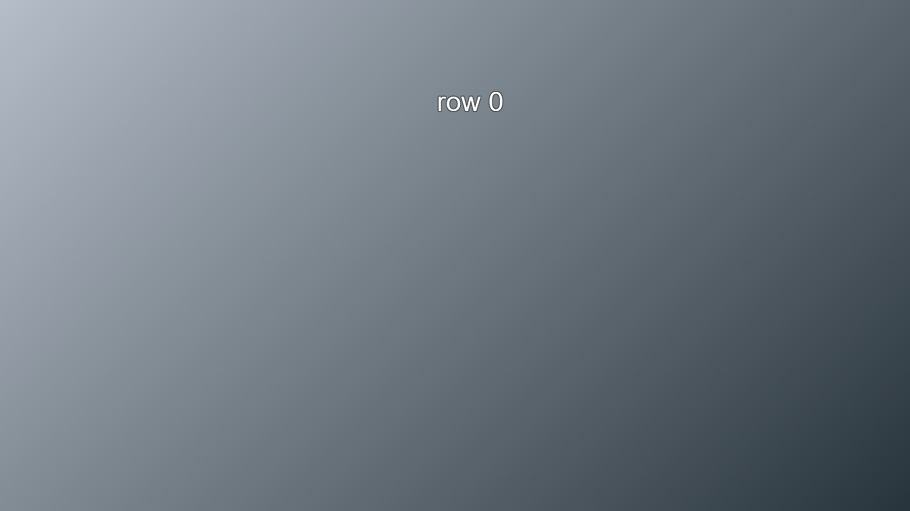


### subtitle 19 at begin=01:01:22.000

#### div XML

```
<div xml:id="19" region="R11" begin="01:01:22.000" end="01:01:26.000" style="_d_default">
   <p style="p_font2">
    <span>top center</span>
   </p>
  </div>
```
#### Resulting Image


### subtitle 20 at begin=01:01:26.120

#### div XML

```
<div xml:id="20" region="R11" begin="01:01:26.120" end="01:01:30.120" style="_d_default dp_al_start">
   <p style="p_font2">
    <span>top left</span>
   </p>
  </div>
```
#### Resulting Image


### subtitle 21 at begin=01:01:30.240

#### div XML

```
<div xml:id="21" region="R11" begin="01:01:30.240" end="01:01:34.240" style="_d_default dp_al_end">
   <p style="p_font2">
    <span>top right</span>
   </p>
  </div>
```
#### Resulting Image


### subtitle 22 at begin=01:01:34.360

#### div XML

```
<div xml:id="22" region="R0" begin="01:01:34.360" end="01:01:38.360" style="_d_default">
   <p style="dp_al_start p_font2">
    <span>left</span>
   </p>
   <p style="p_font2">
    <span>center</span>
   </p>
   <p style="dp_al_end p_font2">
    <span>right</span>
   </p>
  </div>
```
#### Resulting Image

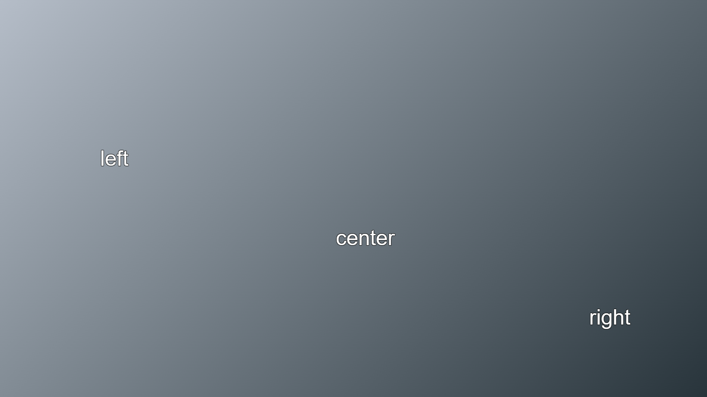


### subtitle 23 at begin=01:01:38.520

#### div XML

```
<div xml:id="23" region="R0" begin="01:01:38.520" end="01:01:42.520" style="_d_default">
   <p style="p_font2">
    <span>normal</span>
    <span style="s_italic"> italic</span>
    <span style="s_bold"> bold </span>
    <span style="s_underline">underline</span>
    <span> normal</span>
   </p>
   <p style="p_font2">
    <span style="s_underline">underlined</span>
    <span style="s_italic s_underline"> italic</span>
    <span style="s_bold s_underline"> bold</span>
    <span style="s_underline"> normal</span>
   </p>
  </div>
```
#### Resulting Image

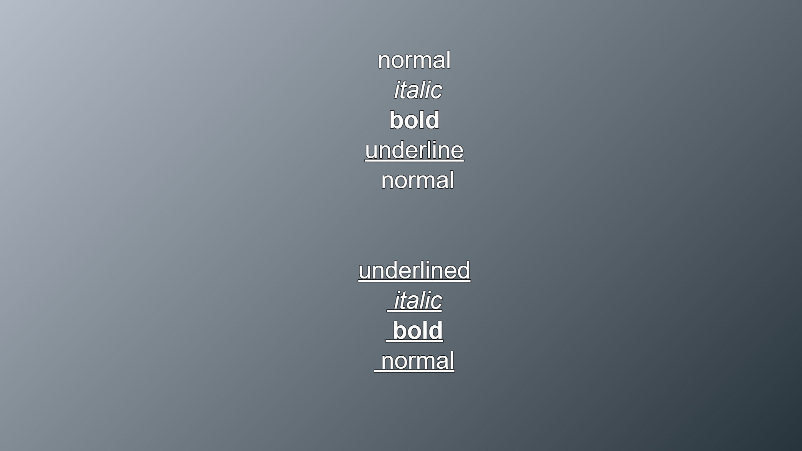


### subtitle 24 at begin=01:01:42.640

#### div XML

```
<div xml:id="24" region="R0" begin="01:01:42.640" end="01:01:46.640" style="_d_default">
   <p style="p_font2">
    <span style="ds_fg_red">red </span>
    <span style="ds_fg_yellow">yellow </span>
    <span style="ds_fg_green">green </span>
    <span style="ds_fg_cyan">cyan </span>
    <span style="ds_fg_blue">blue </span>
    <span style="ds_fg_magenta">magenta</span>
   </p>
  </div>
```
#### Resulting Image

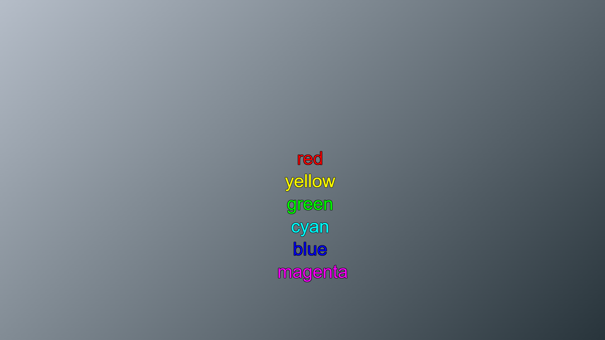


### subtitle 25 at begin=01:01:46.760

#### div XML

```
<div xml:id="25" region="R11" begin="01:01:46.760" end="01:01:50.760" style="_d_default">
   <p style="p_font2">
    <span>Two lines </span>
   </p>
   <p style="p_font2">
    <span>top center</span>
   </p>
  </div>
```
#### Resulting Image

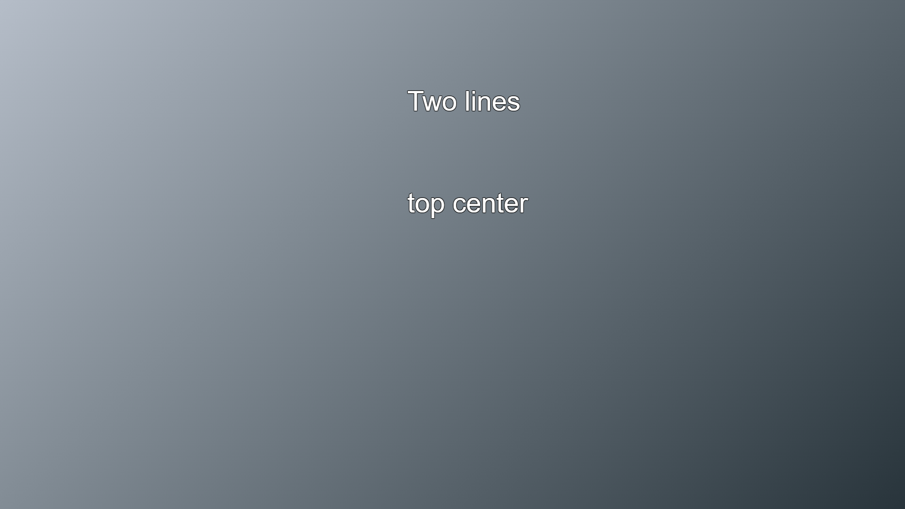


### subtitle 26 at begin=01:01:50.880

#### div XML

```
<div xml:id="26" region="R0" begin="01:01:50.880" end="01:01:53.880" style="_d_default ds_noneblack">
   <p style="p_font2 ps_bg_boxedblack">
    <span>Background stripe</span>
   </p>
   <p style="p_font2 ps_bg_boxedblack">
    <span>black</span>
   </p>
  </div>
```
#### Resulting Image

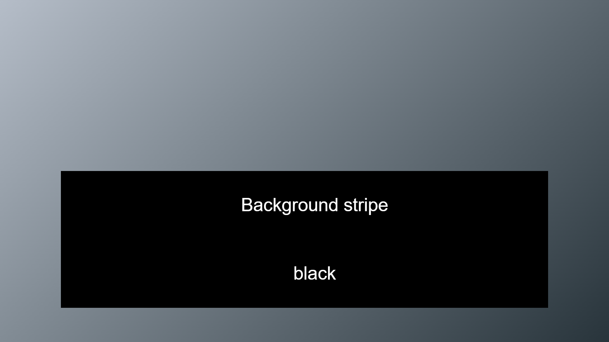


### subtitle 27 at begin=01:01:54.000

#### div XML

```
<div xml:id="27" region="R0" begin="01:01:54.000" end="01:01:57.000" style="_d_default">
   <p style="p_font2">
    <span style="ps_bg_boxedblack">black</span>
   </p>
   <p style="p_font2">
    <span style="ps_bg_boxedblack">box</span>
   </p>
  </div>
```
#### Resulting Image

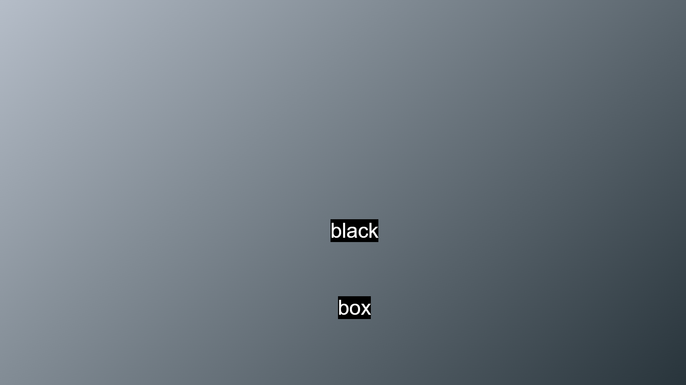


### subtitle 28 at begin=01:01:57.120

#### div XML

```
<div xml:id="28" region="R0" begin="01:01:57.120" end="01:02:00.120" style="_d_default">
   <p style="p_font2">
    <span style="ps_bg_ghostboxedblack">ghost</span>
   </p>
   <p style="p_font2">
    <span style="ps_bg_ghostboxedblack">box</span>
   </p>
  </div>
```
#### Resulting Image

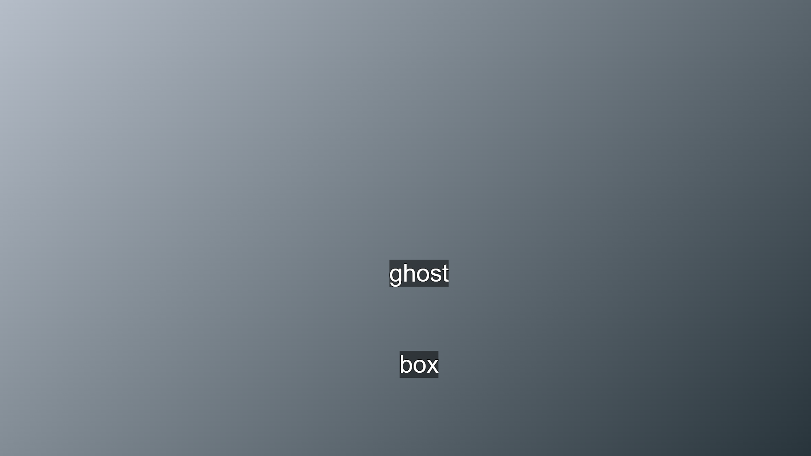


### subtitle 29 at begin=01:02:00.240

#### div XML

```
<div xml:id="29" region="R0" begin="01:02:00.240" end="01:02:03.240" style="_d_default ds_noneblack">
   <p style="p_font2 ps_bg_ghostboxedblack">
    <span>Ghost stripe</span>
   </p>
   <p style="p_font2 ps_bg_ghostboxedblack">
    <span>black</span>
   </p>
  </div>
```
#### Resulting Image


### subtitle 30 at begin=01:02:03.359

#### div XML

```
<div xml:id="30" region="R0" begin="01:02:03.359" end="01:02:06.359" style="_d_default">
   <p style="p_font2">
    <span style="ps_bg_ghostboxedblack">Ghost box change to </span>
    <span style="ps_bg_ghostboxedred ds_nonered">red</span>
   </p>
  </div>
```
#### Resulting Image

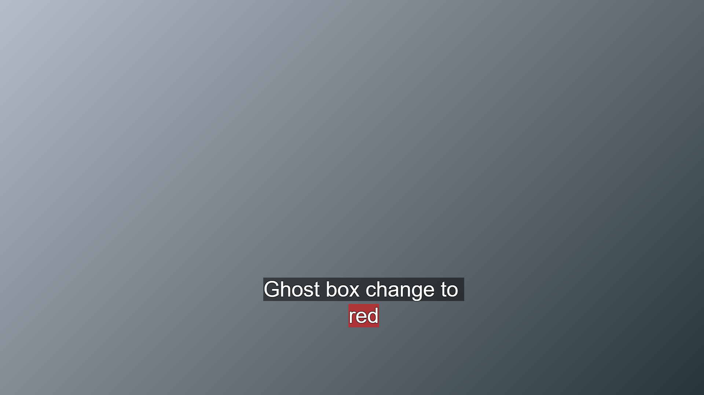


