# Sample file imsc-rosetta-alignment.imscr

## Complete file (expand to see all):


This file is a sample which demonstrates the alignment features of imsc-rosetta.

imsc-rosetta has 9 alignment style names which can be applied to `<p>`:

- p_al_start
- p_al_end
- p_al_center
- p_al_start_center
- p_al_start_end
- p_al_end_start
- p_al_end_center
- p_al_center_start
- p_al_center_end

*note: there are no styles p_al_start_start, p_al_center_center, p_al_end_end - use p_al_start, p_al_center, and p_al_end*

Vertical placement (in horizontal subtitling) is determined by region edge placement.

The region edge against which the subtitle rests is placed according to the quantisation calculated from the extent, fontSize and lineHeight specified in _r_region.

For this file, the region edge position is based on 12 row positions, determined by

row height = 5.333/100 x 125/100 = 6.666/100 or 6.666% of screen height

subtitle vertical area = 80/100

position count = subtitle vertical area/row height = 0.8/0.06666 = ~12

Therefore region edges are quantised to n * 80%/12

*note that file contains ALL imsc-rosetta defined styles as an example - this is not necessary, only the used styles are required*


<details><summary>Expand: imsc-rosetta-alignment.imscr</summary>

```
<?xml version="1.0" encoding="UTF-8" standalone="yes"?>
<tt xmlns="http://www.w3.org/ns/ttml" xmlns:ttm="http://www.w3.org/ns/ttml#metadata" xmlns:tts="http://www.w3.org/ns/ttml#styling" xmlns:ttp="http://www.w3.org/ns/ttml#parameter" xmlns:xml="http://www.w3.org/XML/1998/namespace" xmlns:ebutts="urn:ebu:tt:style" xmlns:itts="http://www.w3.org/ns/ttml/profile/imsc1#styling" xmlns:rosetta="https://github.com/imsc-rosetta/specification" ttp:timeBase="media" ttp:cellResolution="30 15" xml:space="preserve" ttp:frameRate="25" ttp:frameRateMultiplier="1 1" xml:lang="el-GR">
 <head>
  <metadata>
   <rosetta:format>imsc-rosetta</rosetta:format>
   <rosetta:version>0.0.0</rosetta:version>
  </metadata>
  <styling>
   <style xml:id="r_region" tts:wrapOption="noWrap" tts:backgroundColor="transparent" tts:showBackground="whenActive" tts:fontStyle="normal" tts:fontWeight="normal" tts:fontFamily="proportionalSansSerif" tts:textAlign="center" itts:fillLineGap="false" style="_r_default"/>
   <style xml:id="s_italic" tts:fontStyle="italic"/>
   <style xml:id="s_bold" tts:fontWeight="bold"/>
   <style xml:id="s_underline" tts:textDecoration="underline"/>
   <style xml:id="d_fillgap" itts:fillLineGap="true"/>
   <style xml:id="s_fg_black" tts:color="#000000"/>
   <style xml:id="s_fg_red" tts:color="#FF0000"/>
   <style xml:id="s_fg_yellow" tts:color="#FFFF00"/>
   <style xml:id="s_fg_green" tts:color="#00FF00"/>
   <style xml:id="s_fg_cyan" tts:color="#00FFFF"/>
   <style xml:id="s_fg_blue" tts:color="#0000FF"/>
   <style xml:id="s_fg_magenta" tts:color="#FF00FF"/>
   <style xml:id="s_fg_white" tts:color="#FFFFFF"/>
   <style xml:id="ps_bg_boxedblack" tts:backgroundColor="#000000"/>
   <style xml:id="ps_bg_boxedred" tts:backgroundColor="#FF0000"/>
   <style xml:id="ps_bg_boxedyellow" tts:backgroundColor="#FF0000"/>
   <style xml:id="ps_bg_boxedgreen" tts:backgroundColor="#00FF00"/>
   <style xml:id="ps_bg_boxedcyan" tts:backgroundColor="#00FFFF"/>
   <style xml:id="ps_bg_boxedblue" tts:backgroundColor="#0000FF"/>
   <style xml:id="ps_bg_boxedmagenta" tts:backgroundColor="#FF00FF"/>
   <style xml:id="ps_bg_boxedwhite" tts:backgroundColor="#FFFFFF"/>
   <style xml:id="ps_bg_ghostboxedblack" tts:backgroundColor="#00000080"/>
   <style xml:id="ps_bg_ghostboxedred" tts:backgroundColor="#FF000080"/>
   <style xml:id="ps_bg_ghostboxedyellow" tts:backgroundColor="#FFFF0080"/>
   <style xml:id="ps_bg_ghostboxedgreen" tts:backgroundColor="#00FF0080"/>
   <style xml:id="ps_bg_ghostboxedcyan" tts:backgroundColor="#00FFFF80"/>
   <style xml:id="ps_bg_ghostboxedblue" tts:backgroundColor="#0000FF80"/>
   <style xml:id="ps_bg_ghostboxedmagenta" tts:backgroundColor="#FF00FF80"/>
   <style xml:id="ps_bg_ghostboxedwhite" tts:backgroundColor="#FFFFFF80"/>
   <style xml:id="d_outline" tts:textOutline="#000000 0.05em"/>
   <style xml:id="s_outlineblack" tts:textOutline="#000000 0.05em"/>
   <style xml:id="s_outlinered" tts:textOutline="#FF0000 0.05em"/>
   <style xml:id="s_outlineyellow" tts:textOutline="#FFFF00 0.05em"/>
   <style xml:id="s_outlinegreen" tts:textOutline="#00FF00 0.05em"/>
   <style xml:id="s_outlinecyan" tts:textOutline="#00FFFF 0.05em"/>
   <style xml:id="s_outlineblue" tts:textOutline="#0000FF 0.05em"/>
   <style xml:id="s_outlinemagenta" tts:textOutline="#FF00FF 0.05em"/>
   <style xml:id="s_outlinewhite" tts:textOutline="#FFFFFF 0.05em"/>
   <style xml:id="d_drop" tts:textOutline="#000000 0.05em"/>
   <style xml:id="s_dropblack" tts:textOutline="#000000 0.05em"/>
   <style xml:id="s_dropred" tts:textOutline="#FF0000 0.05em"/>
   <style xml:id="s_dropyellow" tts:textOutline="#FFFF00 0.05em"/>
   <style xml:id="s_dropgreen" tts:textOutline="#00FF00 0.05em"/>
   <style xml:id="s_dropcyan" tts:textOutline="#00FFFF 0.05em"/>
   <style xml:id="s_dropblue" tts:textOutline="#0000FF 0.05em"/>
   <style xml:id="s_dropmagenta" tts:textOutline="#FF00FF 0.05em"/>
   <style xml:id="s_dropwhite" tts:textOutline="#FFFFFF 0.05em"/>
   <style xml:id="s_noneblack"/>
   <style xml:id="s_nonered"/>
   <style xml:id="s_noneyellow"/>
   <style xml:id="s_nonegreen"/>
   <style xml:id="s_nonecyan"/>
   <style xml:id="s_noneblue"/>
   <style xml:id="s_nonemagenta"/>
   <style xml:id="s_nonewhite"/>
   <style xml:id="p_al_start" tts:textAlign="start"/>
   <style xml:id="p_al_center" tts:textAlign="center"/>
   <style xml:id="p_al_end" tts:textAlign="end"/>
   <style xml:id="p_al_start_center" ebutts:multiRowAlign="center" tts:textAlign="start"/>
   <style xml:id="p_al_start_end" ebutts:multiRowAlign="end" tts:textAlign="start"/>
   <style xml:id="p_al_end_start" ebutts:multiRowAlign="start" tts:textAlign="end"/>
   <style xml:id="p_al_end_center" ebutts:multiRowAlign="center" tts:textAlign="end"/>
   <style xml:id="p_al_center_start" ebutts:multiRowAlign="start" tts:textAlign="center"/>
   <style xml:id="p_al_center_end" ebutts:multiRowAlign="end" tts:textAlign="center"/>
   <style xml:id="d_forced" itts:forcedDisplay="true"/>
   <style xml:id="p_font1" tts:fontFamily="proportionalSansSerif" tts:lineHeight="125%" tts:fontSize="100%"/>
   <style xml:id="p_font2" tts:fontFamily="proportionalSansSerif" tts:lineHeight="125%" tts:fontSize="100%"/>
   <style xml:id="s_rb_b" tts:ruby="base"/>
   <style xml:id="s_rb_t" tts:ruby="text"/>
   <style xml:id="p_rb_res_outside" tts:rubyReserve="outside"/>
   <style xml:id="s_rb_algn_center" tts:ruby="container" tts:rubyAlign="center"/>
   <style xml:id="s_rb_algn_around" tts:ruby="container" tts:rubyAlign="spaceAround"/>
   <style xml:id="s_rb_posn_outside" tts:ruby="container" tts:rubyPosition="outside"/>
   <style xml:id="s_combine" tts:textCombine="all"/>
   <style xml:id="p_shear" tts:shear="16.67%"/>
   <style xml:id="p_rtl" tts:direction="rtl"/>
   <style xml:id="s_emf_fco" tts:textEmphasis="filled circle outside"/>
   <style xml:id="s_emf_fdo" tts:textEmphasis="filled dot outside"/>
   <style xml:id="s_emf_fso" tts:textEmphasis="filled sesame outside"/>
   <style xml:id="s_emf_oco" tts:textEmphasis="open circle outside"/>
   <style xml:id="s_emf_odo" tts:textEmphasis="open dot outside"/>
   <style xml:id="s_emf_oso" tts:textEmphasis="open sesame outside"/>
   <style xml:id="r_vertical" tts:writingMode="tbrl"/>
   <style xml:id="_d_default" style="d_outline"/>
   <style xml:id="_r_default" tts:origin="10% 10%" tts:extent="80% 80%" tts:displayAlign="after" tts:fontSize="5.333rh" tts:lineHeight="125%" ebutts:linePadding="0.25c" style="s_fg_white"/>
  </styling>
  <layout>
   <region xml:id="R0" tts:origin="10% 10%" tts:extent="80% 80%" tts:displayAlign="after" style="r_region"/>
   <region xml:id="R1" tts:origin="10% 10%" tts:extent="80% 73.3%" tts:displayAlign="after" style="r_region"/>
   <region xml:id="R9" tts:origin="10% 23.3%" tts:extent="80% 66.7%" tts:displayAlign="before" style="r_region"/>
   <region xml:id="R10" tts:origin="10% 16.7%" tts:extent="80% 73.3%" tts:displayAlign="before" style="r_region"/>
   <region xml:id="R11" tts:origin="10% 10%" tts:extent="80% 80%" tts:displayAlign="before" style="r_region"/>
  </layout>
 </head>
 <body>
  <div xml:id="1" region="R0" begin="01:00:07.760" end="01:00:11.760" style="_d_default">
   <p style="p_font2"><span>1 line Center Bottom</span></p>
  </div>
  <div xml:id="2" region="R0" begin="01:00:11.880" end="01:00:15.880" style="_d_default">
   <p style="p_font2 p_al_start"><span>1 line start bottom</span></p>
  </div>
  <div xml:id="3" region="R0" begin="01:00:16.000" end="01:00:20.000" style="_d_default">
   <p style="p_font2 p_al_end"><span>1 line end bottom</span></p>
  </div>
  <div xml:id="4" region="R0" begin="01:00:20.120" end="01:00:24.120" style="_d_default">
   <p style="p_font2"><span>two lines</span><span><br/></span><span>center bottom</span></p>
  </div>
  <div xml:id="5" region="R0" begin="01:00:24.240" end="01:00:28.240" style="_d_default">
   <p style="p_font2 p_al_start"><span>two lines</span><span><br/></span><span>start bottom</span></p>
  </div>
  <div xml:id="6" region="R0" begin="01:00:28.360" end="01:00:32.360" style="_d_default">
   <p style="p_font2 p_al_end"><span>two lines</span><span><br/></span><span>end bottom</span></p>
  </div>
  <div xml:id="7" region="R0" begin="01:00:32.480" end="01:00:36.480" style="_d_default">
   <p style="p_font2 p_al_center_start"><span>two lines</span><span><br/></span><span>center start bottom</span></p>
  </div>
  <div xml:id="8" region="R0" begin="01:00:36.640" end="01:00:40.640" style="_d_default">
   <p style="p_font2 p_al_center_end"><span>two lines</span><span><br/></span><span>center end bottom</span></p>
  </div>
  <div xml:id="9" region="R0" begin="01:00:40.760" end="01:00:44.760" style="_d_default">
   <p style="p_font2 p_al_start_center"><span>two lines</span><span><br/></span><span>start center bottom</span></p>
  </div>
  <div xml:id="10" region="R0" begin="01:00:44.880" end="01:00:48.880" style="_d_default">
   <p style="p_font2 p_al_start_end"><span>two lines</span><span><br/></span><span>start end bottom</span></p>
  </div>
  <div xml:id="11" region="R0" begin="01:00:49.000" end="01:00:53.000" style="_d_default">
   <p style="p_font2 p_al_end_start"><span>two lines</span><span><br/></span><span>end start bottom</span></p>
  </div>
  <div xml:id="12" region="R0" begin="01:00:53.120" end="01:00:57.120" style="_d_default">
   <p style="p_font2 p_al_end_center"><span>two lines</span><span><br/></span><span>end center bottom</span></p>
  </div>
  <div xml:id="13" region="R0" begin="01:00:57.240" end="01:01:01.240" style="_d_default">
   <p style="p_font2 p_al_start"><span>left</span></p>
   <p style="p_font2"><span>center</span></p>
   <p style="p_font2 p_al_end"><span>right</span></p>
  </div>
  <div xml:id="14" region="R1" begin="01:01:01.360" end="01:01:05.360" style="_d_default">
   <p style="p_font2"><span>row 11/12 (about one line from bottom)</span></p>
  </div>
  <div xml:id="15" region="R11" begin="01:01:05.480" end="01:01:09.480" style="_d_default">
   <p style="p_font2"><span>row 1/12 (top)</span></p>
  </div>
  <div xml:id="16" region="R9" begin="01:01:09.640" end="01:01:13.640" style="_d_default">
   <p style="p_font2"><span>row 3/12</span></p>
  </div>
  <div xml:id="17" region="R10" begin="01:01:13.760" end="01:01:17.760" style="_d_default">
   <p style="p_font2"><span>row 2/12</span></p>
  </div>
  <div xml:id="18" region="R11" begin="01:01:17.880" end="01:01:21.880" style="_d_default">
   <p style="p_font2"><span>row 1/12</span></p>
  </div>
  <div xml:id="19" region="R11" begin="01:01:22.000" end="01:01:26.000" style="_d_default">
   <p style="p_font2"><span>top center</span></p>
  </div>
  <div xml:id="20" region="R11" begin="01:01:26.120" end="01:01:30.120" style="_d_default p_al_start">
   <p style="p_font2"><span>top left</span></p>
  </div>
  <div xml:id="21" region="R11" begin="01:01:30.240" end="01:01:34.240" style="_d_default p_al_end">
   <p style="p_font2"><span>top right</span></p>
  </div>
  <div xml:id="22" region="R11" begin="01:01:34.360" end="01:01:38.360" style="_d_default">
   <p style="p_font2 p_al_start"><span>top left</span></p>
   <p style="p_font2"><span>center</span></p>
   <p style="p_font2 p_al_end"><span>right</span></p>
  </div>
 </body>
</tt>
```

</details>

## Divs with images:


### subtitle 1 at begin=01:00:07.760


This div represents a single line centered at the bottom of the screen.  Note the absence of a p_al_ style - here we are using the default position which is fixed as center in imsc-rosetta.


#### div XML

```
<div xml:id="1" region="R0" begin="01:00:07.760" end="01:00:11.760" style="_d_default">
 <p style="p_font2"><span>1 line Center Bottom</span></p>
</div>
```
#### Resulting Image

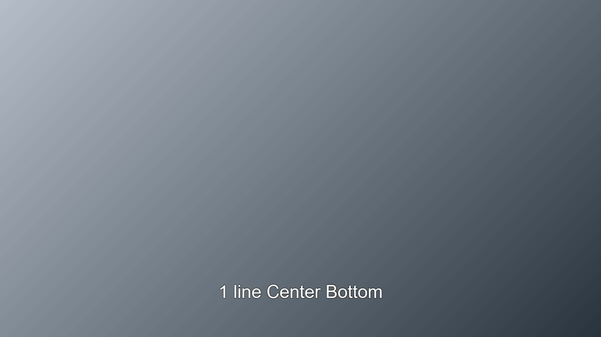


### subtitle 2 at begin=01:00:11.880


This div represents a single line on the left using p_al_start in left to right text.


#### div XML

```
<div xml:id="2" region="R0" begin="01:00:11.880" end="01:00:15.880" style="_d_default">
 <p style="p_font2 p_al_start"><span>1 line start bottom</span></p>
</div>
```
#### Resulting Image


### subtitle 3 at begin=01:00:16.000


This div represents a single line on the right using p_al_end in left to right text.


#### div XML

```
<div xml:id="3" region="R0" begin="01:00:16.000" end="01:00:20.000" style="_d_default">
 <p style="p_font2 p_al_end"><span>1 line end bottom</span></p>
</div>
```
#### Resulting Image


### subtitle 4 at begin=01:00:20.120


This div represents two lines centered at the bottom.  Note the absence of a p_al_ style - here we are using the default position which is fixed as center in imsc-rosetta.


#### div XML

```
<div xml:id="4" region="R0" begin="01:00:20.120" end="01:00:24.120" style="_d_default">
 <p style="p_font2"><span>two lines</span><span><br/></span><span>center bottom</span></p>
</div>
```
#### Resulting Image

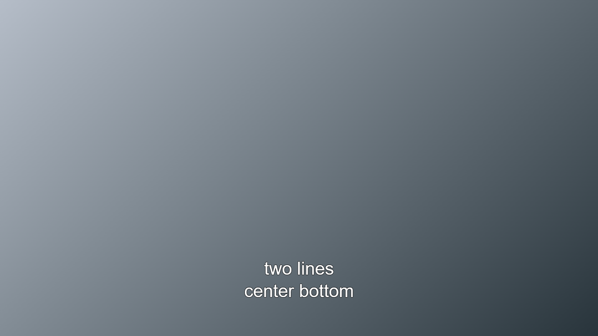


### subtitle 5 at begin=01:00:24.240


This div represents two lines on the left bottom using p_al_start in left to right text.


#### div XML

```
<div xml:id="5" region="R0" begin="01:00:24.240" end="01:00:28.240" style="_d_default">
 <p style="p_font2 p_al_start"><span>two lines</span><span><br/></span><span>start bottom</span></p>
</div>
```
#### Resulting Image


### subtitle 6 at begin=01:00:28.360


This div represents two lines on the right bottom using p_al_end in left to right text.


#### div XML

```
<div xml:id="6" region="R0" begin="01:00:28.360" end="01:00:32.360" style="_d_default">
 <p style="p_font2 p_al_end"><span>two lines</span><span><br/></span><span>end bottom</span></p>
</div>
```
#### Resulting Image

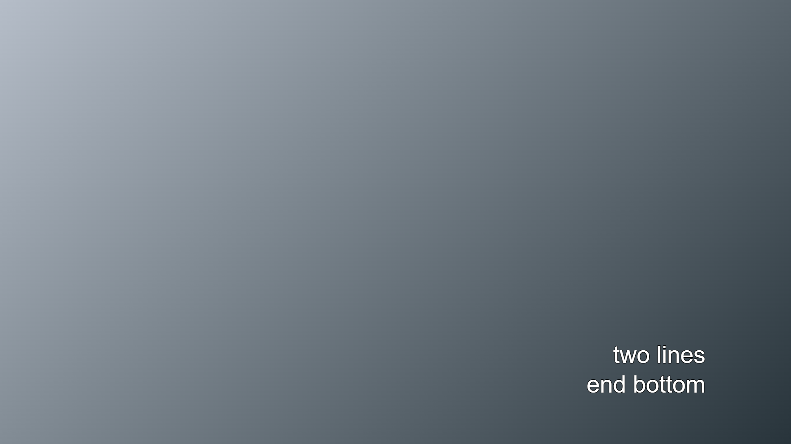


### subtitle 7 at begin=01:00:32.480


This div represents two lines, where the longest line is centered, and the shorter line left aligned to the longer line (commonly know as center left align) using p_al_center_start in left to right text.


#### div XML

```
<div xml:id="7" region="R0" begin="01:00:32.480" end="01:00:36.480" style="_d_default">
 <p style="p_font2 p_al_center_start"><span>two lines</span><span><br/></span><span>center start bottom</span></p>
</div>
```
#### Resulting Image


### subtitle 8 at begin=01:00:36.640


This div represents two lines, where the longest line is centered, and the shorter line right aligned to the longer line (uncommon) using p_al_center_end in left to right text.


#### div XML

```
<div xml:id="8" region="R0" begin="01:00:36.640" end="01:00:40.640" style="_d_default">
 <p style="p_font2 p_al_center_end"><span>two lines</span><span><br/></span><span>center end bottom</span></p>
</div>
```
#### Resulting Image

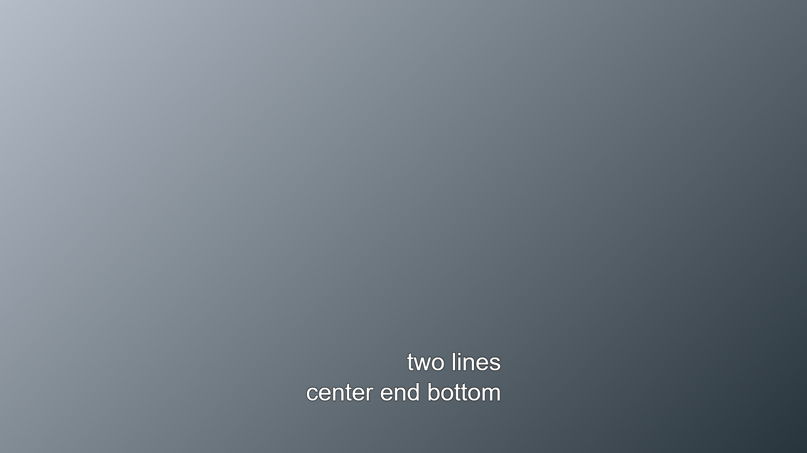


### subtitle 9 at begin=01:00:40.760


This div represents two lines, where the longest line is left aligned, and the shorter line center aligned relative to longer line (uncommon) using p_al_start_center in left to right text.


#### div XML

```
<div xml:id="9" region="R0" begin="01:00:40.760" end="01:00:44.760" style="_d_default">
 <p style="p_font2 p_al_start_center"><span>two lines</span><span><br/></span><span>start center bottom</span></p>
</div>
```
#### Resulting Image

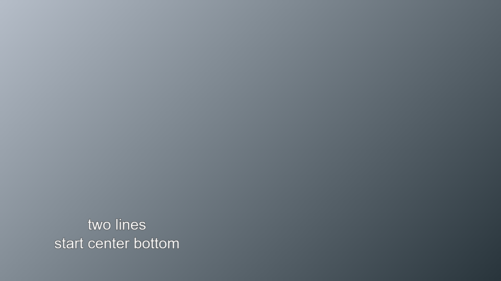


### subtitle 10 at begin=01:00:44.880


This div represents two lines, where the longest line is left aligned, and the shorter line right aligned relative to longer line (uncommon) using p_al_start_end in left to right text.


#### div XML

```
<div xml:id="10" region="R0" begin="01:00:44.880" end="01:00:48.880" style="_d_default">
 <p style="p_font2 p_al_start_end"><span>two lines</span><span><br/></span><span>start end bottom</span></p>
</div>
```
#### Resulting Image

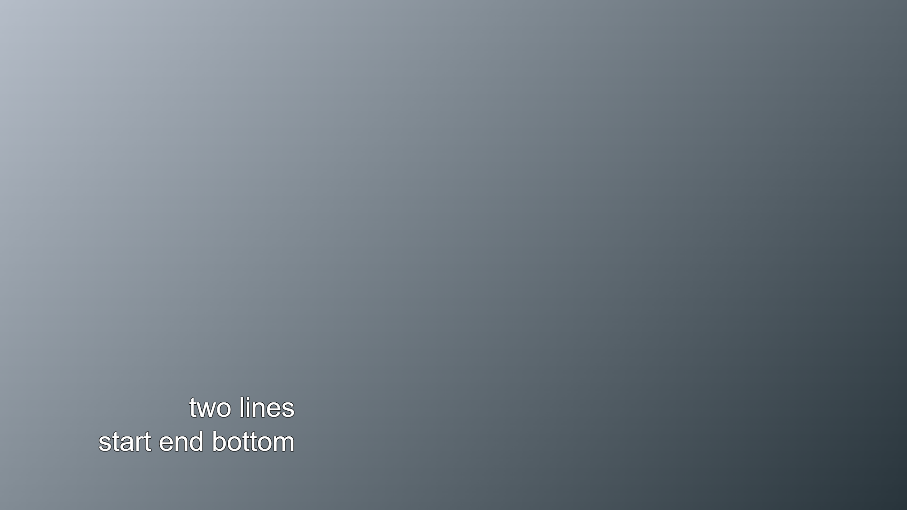


### subtitle 11 at begin=01:00:49.000


This div represents two lines, where the longest line is right aligned, and the shorter line left aligned relative to longer line (uncommon) using p_al_end_start in left to right text.


#### div XML

```
<div xml:id="11" region="R0" begin="01:00:49.000" end="01:00:53.000" style="_d_default">
 <p style="p_font2 p_al_end_start"><span>two lines</span><span><br/></span><span>end start bottom</span></p>
</div>
```
#### Resulting Image

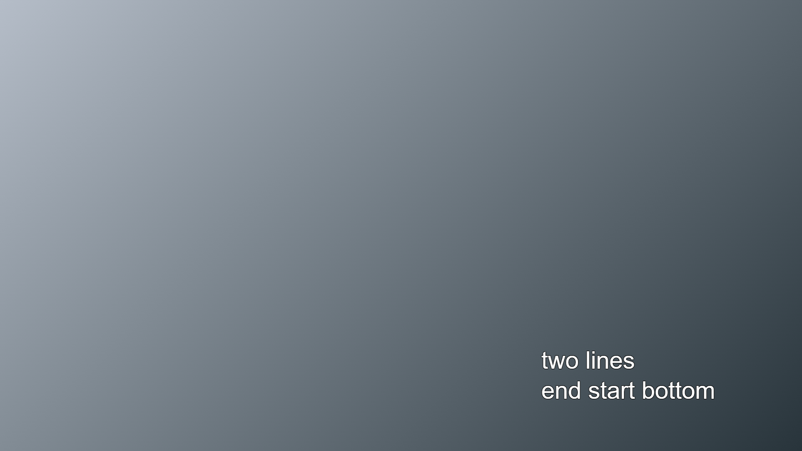


### subtitle 12 at begin=01:00:53.120


This div represents two lines, where the longest line is right aligned, and the shorter line center aligned relative to longer line (uncommon) using p_al_end_center in left to right text.


#### div XML

```
<div xml:id="12" region="R0" begin="01:00:53.120" end="01:00:57.120" style="_d_default">
 <p style="p_font2 p_al_end_center"><span>two lines</span><span><br/></span><span>end center bottom</span></p>
</div>
```
#### Resulting Image

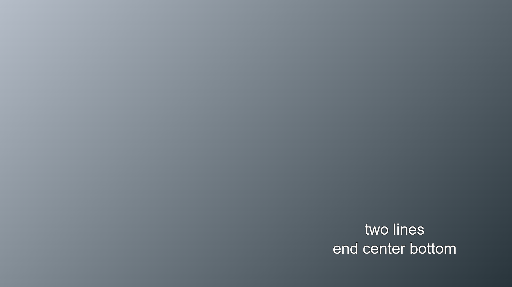


### subtitle 13 at begin=01:00:57.240


This div represents three lines, where the first is left aligned, the second is centered, and the third is right aligned.  This uses three separate `<p>` elements, marked with p_al_start, p_al_center_ and p_al_end respectively.


#### div XML

```
<div xml:id="13" region="R0" begin="01:00:57.240" end="01:01:01.240" style="_d_default">
 <p style="p_font2 p_al_start"><span>left</span></p>
 <p style="p_font2"><span>center</span></p>
 <p style="p_font2 p_al_end"><span>right</span></p>
</div>
```
#### Resulting Image

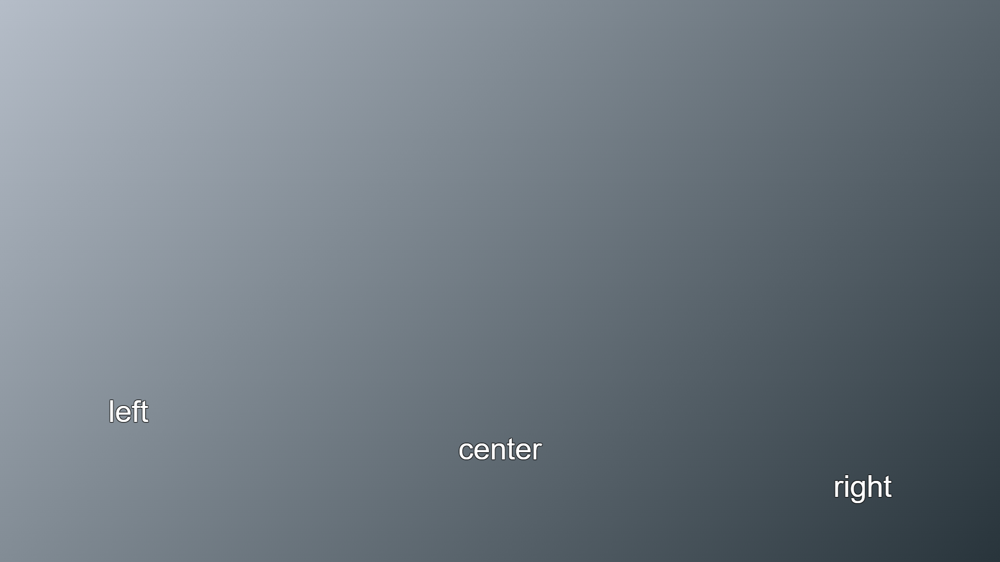


### subtitle 14 at begin=01:01:01.360


Subtitles 14-22 demonstrate vertical positioning using regions.


#### div XML

```
<div xml:id="14" region="R1" begin="01:01:01.360" end="01:01:05.360" style="_d_default">
 <p style="p_font2"><span>row 11/12 (about one line from bottom)</span></p>
</div>
```
#### Resulting Image

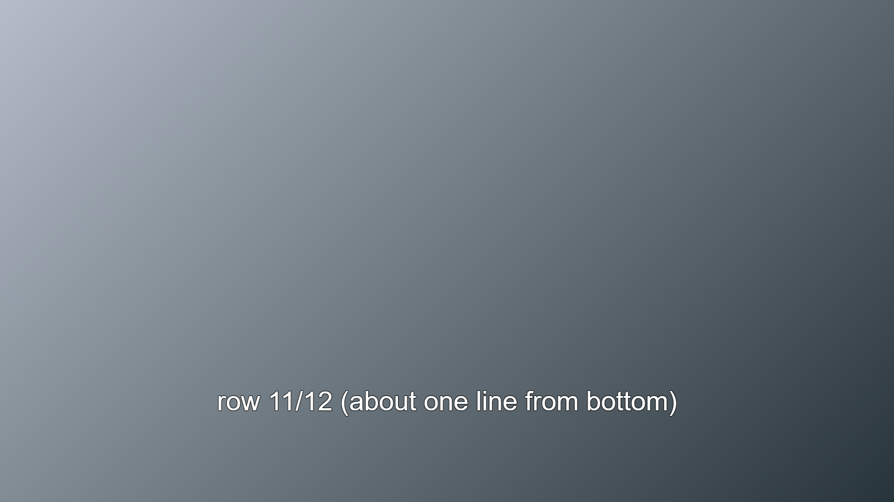


### subtitle 15 at begin=01:01:05.480

#### div XML

```
<div xml:id="15" region="R11" begin="01:01:05.480" end="01:01:09.480" style="_d_default">
 <p style="p_font2"><span>row 1/12 (top)</span></p>
</div>
```
#### Resulting Image

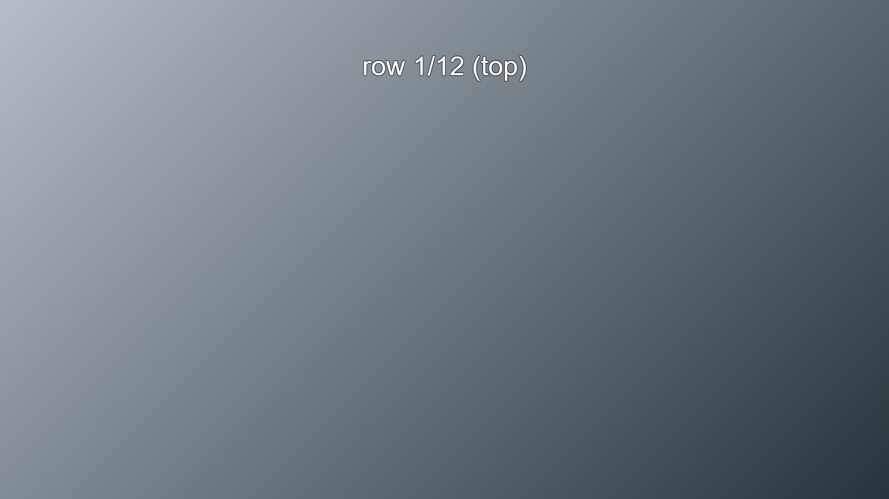


### subtitle 16 at begin=01:01:09.640

#### div XML

```
<div xml:id="16" region="R9" begin="01:01:09.640" end="01:01:13.640" style="_d_default">
 <p style="p_font2"><span>row 3/12</span></p>
</div>
```
#### Resulting Image

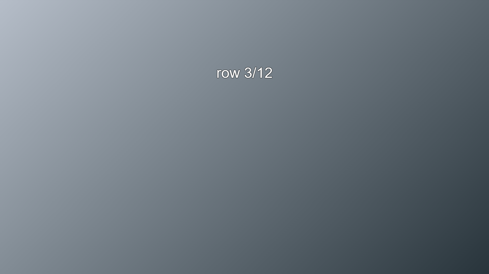


### subtitle 17 at begin=01:01:13.760

#### div XML

```
<div xml:id="17" region="R10" begin="01:01:13.760" end="01:01:17.760" style="_d_default">
 <p style="p_font2"><span>row 2/12</span></p>
</div>
```
#### Resulting Image

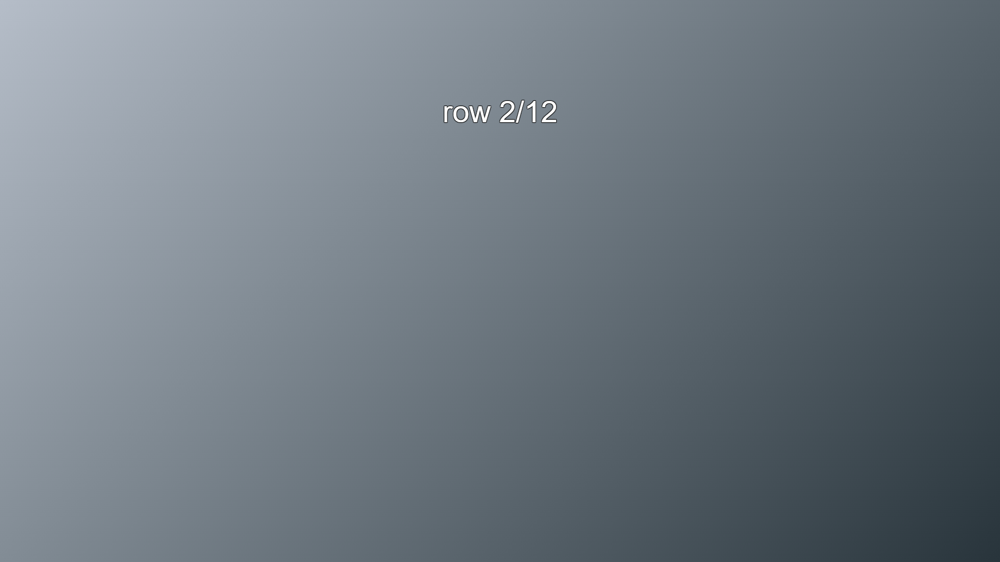


### subtitle 18 at begin=01:01:17.880

#### div XML

```
<div xml:id="18" region="R11" begin="01:01:17.880" end="01:01:21.880" style="_d_default">
 <p style="p_font2"><span>row 1/12</span></p>
</div>
```
#### Resulting Image


### subtitle 19 at begin=01:01:22.000

#### div XML

```
<div xml:id="19" region="R11" begin="01:01:22.000" end="01:01:26.000" style="_d_default">
 <p style="p_font2"><span>top center</span></p>
</div>
```
#### Resulting Image


### subtitle 20 at begin=01:01:26.120

#### div XML

```
<div xml:id="20" region="R11" begin="01:01:26.120" end="01:01:30.120" style="_d_default p_al_start">
 <p style="p_font2"><span>top left</span></p>
</div>
```
#### Resulting Image


### subtitle 21 at begin=01:01:30.240

#### div XML

```
<div xml:id="21" region="R11" begin="01:01:30.240" end="01:01:34.240" style="_d_default p_al_end">
 <p style="p_font2"><span>top right</span></p>
</div>
```
#### Resulting Image


### subtitle 22 at begin=01:01:34.360

#### div XML

```
<div xml:id="22" region="R11" begin="01:01:34.360" end="01:01:38.360" style="_d_default">
 <p style="p_font2 p_al_start"><span>top left</span></p>
 <p style="p_font2"><span>center</span></p>
 <p style="p_font2 p_al_end"><span>right</span></p>
</div>
```
#### Resulting Image

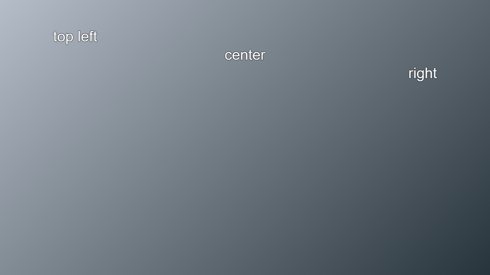


