# Sample file imsc-rosetta-boxing.imscr


This file is a sample which demonstrates the boxing features of imsc-rosetta.

In imsc-rosetta, subtitles can be boxed in a variety of ways:

- unboxed
- solid boxing
- ghost boxing (semi-transparent)
- solid stripe (box which extends to the maximum subtitle area in the writing direction)
- ghost stripe (semi-transparent)

The background color of text can be changed if boxed

*note that file contains ALL imsc-rosetta defined styles as an example - this is not necessary, only the used styles are required*


## Complete file (click expand to see all) [download](./imscr/imsc-rosetta-boxing.imscr)

<details><summary>Expand: imsc-rosetta-boxing.imscr</summary>

```
<?xml version="1.0" encoding="UTF-8" standalone="yes"?>
<tt xmlns="http://www.w3.org/ns/ttml" xmlns:ttm="http://www.w3.org/ns/ttml#metadata" xmlns:tts="http://www.w3.org/ns/ttml#styling" xmlns:ttp="http://www.w3.org/ns/ttml#parameter" xmlns:xml="http://www.w3.org/XML/1998/namespace" xmlns:ebutts="urn:ebu:tt:style" xmlns:itts="http://www.w3.org/ns/ttml/profile/imsc1#styling" xmlns:rosetta="https://github.com/imsc-rosetta/specification" ttp:timeBase="media" ttp:cellResolution="30 15" xml:space="preserve" ttp:frameRate="25" ttp:frameRateMultiplier="1 1" xml:lang="el-GR">
 <head>
  <metadata>
   <rosetta:format>imsc-rosetta</rosetta:format>
   <rosetta:version>0.0.0</rosetta:version>
  </metadata>
  <styling>
   <style xml:id="r_region" tts:wrapOption="noWrap" tts:backgroundColor="transparent" tts:showBackground="whenActive" tts:fontStyle="normal" tts:fontWeight="normal" tts:fontFamily="proportionalSansSerif" tts:textAlign="center" itts:fillLineGap="false" style="_r_default"/>
   <style xml:id="s_italic" tts:fontStyle="italic"/>
   <style xml:id="s_bold" tts:fontWeight="bold"/>
   <style xml:id="s_underline" tts:textDecoration="underline"/>
   <style xml:id="d_default" style="_d_default"/>
   <style xml:id="d_fillgap" itts:fillLineGap="true"/>
   <style xml:id="s_fg_black" tts:color="#000000"/>
   <style xml:id="s_fg_red" tts:color="#FF0000"/>
   <style xml:id="s_fg_yellow" tts:color="#FFFF00"/>
   <style xml:id="s_fg_green" tts:color="#00FF00"/>
   <style xml:id="s_fg_cyan" tts:color="#00FFFF"/>
   <style xml:id="s_fg_blue" tts:color="#0000FF"/>
   <style xml:id="s_fg_magenta" tts:color="#FF00FF"/>
   <style xml:id="s_fg_white" tts:color="#FFFFFF"/>
   <style xml:id="ps_bg_boxedblack" tts:backgroundColor="#000000"/>
   <style xml:id="ps_bg_boxedred" tts:backgroundColor="#FF0000"/>
   <style xml:id="ps_bg_boxedyellow" tts:backgroundColor="#FF0000"/>
   <style xml:id="ps_bg_boxedgreen" tts:backgroundColor="#00FF00"/>
   <style xml:id="ps_bg_boxedcyan" tts:backgroundColor="#00FFFF"/>
   <style xml:id="ps_bg_boxedblue" tts:backgroundColor="#0000FF"/>
   <style xml:id="ps_bg_boxedmagenta" tts:backgroundColor="#FF00FF"/>
   <style xml:id="ps_bg_boxedwhite" tts:backgroundColor="#FFFFFF"/>
   <style xml:id="ps_bg_ghostboxedblack" tts:backgroundColor="#00000080"/>
   <style xml:id="ps_bg_ghostboxedred" tts:backgroundColor="#FF000080"/>
   <style xml:id="ps_bg_ghostboxedyellow" tts:backgroundColor="#FFFF0080"/>
   <style xml:id="ps_bg_ghostboxedgreen" tts:backgroundColor="#00FF0080"/>
   <style xml:id="ps_bg_ghostboxedcyan" tts:backgroundColor="#00FFFF80"/>
   <style xml:id="ps_bg_ghostboxedblue" tts:backgroundColor="#0000FF80"/>
   <style xml:id="ps_bg_ghostboxedmagenta" tts:backgroundColor="#FF00FF80"/>
   <style xml:id="ps_bg_ghostboxedwhite" tts:backgroundColor="#FFFFFF80"/>
   <style xml:id="d_outline" tts:textOutline="#000000 0.05em"/>
   <style xml:id="s_outlineblack" tts:textOutline="#000000 0.05em"/>
   <style xml:id="s_outlinered" tts:textOutline="#FF0000 0.05em"/>
   <style xml:id="s_outlineyellow" tts:textOutline="#FFFF00 0.05em"/>
   <style xml:id="s_outlinegreen" tts:textOutline="#00FF00 0.05em"/>
   <style xml:id="s_outlinecyan" tts:textOutline="#00FFFF 0.05em"/>
   <style xml:id="s_outlineblue" tts:textOutline="#0000FF 0.05em"/>
   <style xml:id="s_outlinemagenta" tts:textOutline="#FF00FF 0.05em"/>
   <style xml:id="s_outlinewhite" tts:textOutline="#FFFFFF 0.05em"/>
   <style xml:id="d_drop" tts:textOutline="#000000 0.05em"/>
   <style xml:id="s_dropblack" tts:textOutline="#000000 0.05em"/>
   <style xml:id="s_dropred" tts:textOutline="#FF0000 0.05em"/>
   <style xml:id="s_dropyellow" tts:textOutline="#FFFF00 0.05em"/>
   <style xml:id="s_dropgreen" tts:textOutline="#00FF00 0.05em"/>
   <style xml:id="s_dropcyan" tts:textOutline="#00FFFF 0.05em"/>
   <style xml:id="s_dropblue" tts:textOutline="#0000FF 0.05em"/>
   <style xml:id="s_dropmagenta" tts:textOutline="#FF00FF 0.05em"/>
   <style xml:id="s_dropwhite" tts:textOutline="#FFFFFF 0.05em"/>
   <style xml:id="s_noneblack"/>
   <style xml:id="s_nonered"/>
   <style xml:id="s_noneyellow"/>
   <style xml:id="s_nonegreen"/>
   <style xml:id="s_nonecyan"/>
   <style xml:id="s_noneblue"/>
   <style xml:id="s_nonemagenta"/>
   <style xml:id="s_nonewhite"/>
   <style xml:id="p_al_start" tts:textAlign="start"/>
   <style xml:id="p_al_center" tts:textAlign="center"/>
   <style xml:id="p_al_end" tts:textAlign="end"/>
   <style xml:id="p_al_start_center" ebutts:multiRowAlign="center" tts:textAlign="start"/>
   <style xml:id="p_al_start_end" ebutts:multiRowAlign="end" tts:textAlign="start"/>
   <style xml:id="p_al_end_start" ebutts:multiRowAlign="start" tts:textAlign="end"/>
   <style xml:id="p_al_end_center" ebutts:multiRowAlign="center" tts:textAlign="end"/>
   <style xml:id="p_al_center_start" ebutts:multiRowAlign="start" tts:textAlign="center"/>
   <style xml:id="p_al_center_end" ebutts:multiRowAlign="end" tts:textAlign="center"/>
   <style xml:id="d_forced" itts:forcedDisplay="true"/>
   <style xml:id="p_font1" tts:fontFamily="proportionalSansSerif" tts:lineHeight="125%" tts:fontSize="100%"/>
   <style xml:id="p_font2" tts:fontFamily="proportionalSansSerif" tts:lineHeight="125%" tts:fontSize="100%"/>
   <style xml:id="s_rb_b" tts:ruby="base"/>
   <style xml:id="s_rb_t" tts:ruby="text"/>
   <style xml:id="p_rb_res_outside" tts:rubyReserve="outside"/>
   <style xml:id="s_rb_algn_center" tts:ruby="container" tts:rubyAlign="center"/>
   <style xml:id="s_rb_algn_around" tts:ruby="container" tts:rubyAlign="spaceAround"/>
   <style xml:id="s_rb_posn_outside" tts:ruby="container" tts:rubyPosition="outside"/>
   <style xml:id="s_combine" tts:textCombine="all"/>
   <style xml:id="p_shear" tts:shear="16.67%"/>
   <style xml:id="p_rtl" tts:direction="rtl"/>
   <style xml:id="s_emf_fco" tts:textEmphasis="filled circle outside"/>
   <style xml:id="s_emf_fdo" tts:textEmphasis="filled dot outside"/>
   <style xml:id="s_emf_fso" tts:textEmphasis="filled sesame outside"/>
   <style xml:id="s_emf_oco" tts:textEmphasis="open circle outside"/>
   <style xml:id="s_emf_odo" tts:textEmphasis="open dot outside"/>
   <style xml:id="s_emf_oso" tts:textEmphasis="open sesame outside"/>
   <style xml:id="r_vertical" tts:writingMode="tbrl" style="_r_vertical"/>
   <style xml:id="_d_default" style="d_outline"/>
   <style xml:id="_r_default" tts:fontSize="5.333rh" tts:lineHeight="125%" ebutts:linePadding="0.25c" style="s_fg_white"/>
   <style xml:id="_r_vertical" style=""/>
   <style xml:id="_r_quantisationregion" tts:origin="10% 10%" tts:extent="80% 80%" tts:fontSize="5.333rh" tts:lineHeight="125%"/>
  </styling>
  <layout>
   <region xml:id="R0" tts:origin="10% 10%" tts:extent="80% 80%" tts:displayAlign="after" style="r_region"/>
  </layout>
 </head>
 <body>
  <div xml:id="1" region="R0" begin="01:00:03.600" end="01:00:07.640" style="d_default">
   <p style="p_font2"><span>Unboxed</span><span><br/></span><span>line 2</span></p>
  </div>
  <div xml:id="2" region="R0" begin="01:00:07.760" end="01:00:11.760" style="d_default">
   <p style="p_font2"><span style="ps_bg_boxedblack">Solid Boxed</span><span><br/></span><span style="ps_bg_boxedblack">line 2 descender:y ascender:Á</span></p>
  </div>
  <div xml:id="3" region="R0" begin="01:00:11.880" end="01:00:15.880" style="d_default">
   <p style="p_font2"><span style="ps_bg_ghostboxedblack">Ghost Boxed</span><span><br/></span><span style="ps_bg_ghostboxedblack">line 2</span></p>
  </div>
  <div xml:id="4" region="R0" begin="01:00:16.000" end="01:00:20.000" style="d_default">
   <p style="p_font2 ps_bg_boxedblack"><span>Solid Stripe</span><span><br/></span><span>line 2</span></p>
  </div>
  <div xml:id="5" region="R0" begin="01:00:20.120" end="01:00:24.120" style="d_default">
   <p style="p_font2 ps_bg_ghostboxedblack"><span>Ghost Stripe</span><span><br/></span><span>line 2</span></p>
  </div>
  <div xml:id="6" region="R0" begin="01:00:24.240" end="01:00:28.240" style="d_default">
   <p style="p_font2"><span>Unboxed change to </span><span style="s_outlinered">red </span><span>then </span><span style="s_outlineblue">blue</span><span><br/></span><span>line 2</span></p>
  </div>
  <div xml:id="7" region="R0" begin="01:00:28.360" end="01:00:32.360" style="d_default">
   <p style="p_font2"><span style="ps_bg_boxedblack">Solid boxed change to </span><span style="ps_bg_boxedred">red </span><span style="ps_bg_boxedblack">then </span><span style="ps_bg_boxedblue">blue</span><span><br/></span><span style="ps_bg_boxedblack">line 2</span></p>
  </div>
  <div xml:id="8" region="R0" begin="01:00:32.480" end="01:00:36.480" style="d_default">
   <p style="p_font2"><span style="ps_bg_ghostboxedblack">Ghost boxed change to </span><span style="ps_bg_ghostboxedred">red </span><span style="ps_bg_ghostboxedblack">then </span><span style="ps_bg_ghostboxedblue">blue</span><span><br/></span><span style="ps_bg_ghostboxedblack">line 2</span></p>
  </div>
  <div xml:id="9" region="R0" begin="01:00:36.640" end="01:00:40.640" style="d_default">
   <p style="p_font2 ps_bg_boxedblack"><span>Solid Stripe change to </span><span style="ps_bg_boxedred">red </span><span>then </span><span style="ps_bg_boxedblue">blue</span><span><br/></span><span>line 2</span></p>
  </div>
  <div xml:id="10" region="R0" begin="01:00:40.760" end="01:00:44.760" style="d_default">
   <p style="p_font2 ps_bg_ghostboxedblack"><span>Ghost Stripe change to </span><span style="ps_bg_ghostboxedred">red </span><span>then </span><span style="ps_bg_ghostboxedblue">blue</span><span><br/></span><span>line 2</span></p>
  </div>
  <div xml:id="11" region="R0" begin="01:00:45.760" end="01:00:48.760" style="d_default d_fillgap">
   <p style="p_font2"><span style="ps_bg_boxedblack">Solid Boxed - fillgap</span><span><br/></span><span style="ps_bg_boxedblack">line 2 descender:y ascender:Á</span></p>
  </div>
  <div xml:id="12" region="R0" begin="01:00:49.880" end="01:00:54.880" style="d_default d_fillgap">
   <p style="p_font2"><span style="ps_bg_ghostboxedblack">Ghost Boxed - fillgap</span><span><br/></span><span><br/></span><span style="ps_bg_ghostboxedblack">line 2</span></p>
  </div>
</body>
</tt>
```

</details>

## Divs with images:


### subtitle 1 at begin=01:00:03.600


Unboxed.  Note that this file has black outline (d_outline) in _d_default.


#### div XML

```
<div xml:id="1" region="R0" begin="01:00:03.600" end="01:00:07.640" style="d_default">
   <p style="p_font2"><span>Unboxed</span><span><br/></span><span>line 2</span></p>
  </div>
```
#### Resulting Image

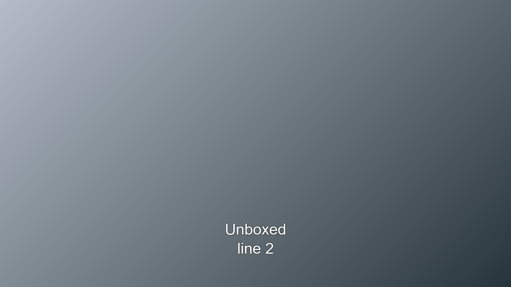


### subtitle 2 at begin=01:00:07.760


Solid black box.  Note if you look closely, parts of 'y' and 'Á' go outside of the box, and are outlined.

Sometimes used as a channel style.  Other times used to make text readable when on top of a bright or contrasty background.


#### div XML

```
<div xml:id="2" region="R0" begin="01:00:07.760" end="01:00:11.760" style="d_default">
   <p style="p_font2"><span style="ps_bg_boxedblack">Solid Boxed</span><span><br/></span><span style="ps_bg_boxedblack">line 2 descender:y ascender:Á</span></p>
  </div>
```
#### Resulting Image

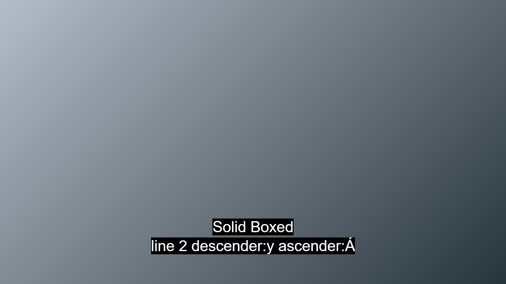


### subtitle 3 at begin=01:00:11.880


Ghost box

Sometimes used as a channel style.  Other times used to make text readable when on top of a bright or contrasty background.


#### div XML

```
<div xml:id="3" region="R0" begin="01:00:11.880" end="01:00:15.880" style="d_default">
   <p style="p_font2"><span style="ps_bg_ghostboxedblack">Ghost Boxed</span><span><br/></span><span style="ps_bg_ghostboxedblack">line 2</span></p>
  </div>
```
#### Resulting Image

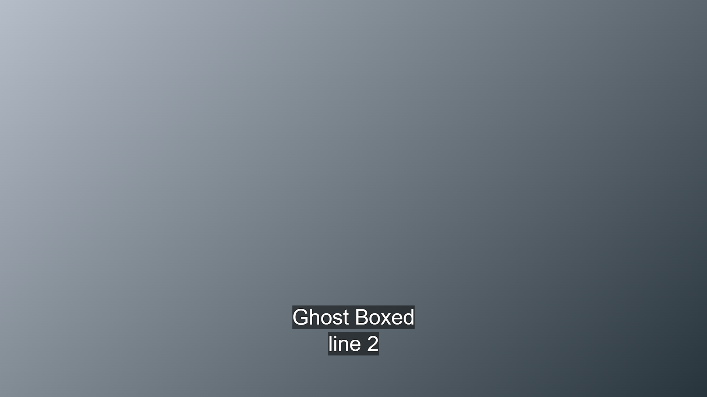


### subtitle 4 at begin=01:00:16.000


Solid Stripe

Generally used to cover existing text more fully that a box around the text only would.


#### div XML

```
<div xml:id="4" region="R0" begin="01:00:16.000" end="01:00:20.000" style="d_default">
   <p style="p_font2 ps_bg_boxedblack"><span>Solid Stripe</span><span><br/></span><span>line 2</span></p>
  </div>
```
#### Resulting Image

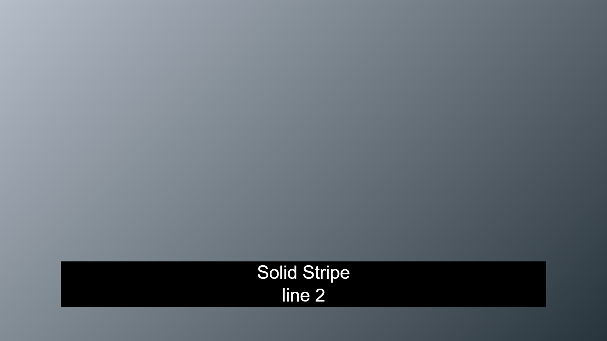


### subtitle 5 at begin=01:00:20.120


Ghost Stripe

Generally used to cover existing text more fully that a box around the text only would.


#### div XML

```
<div xml:id="5" region="R0" begin="01:00:20.120" end="01:00:24.120" style="d_default">
   <p style="p_font2 ps_bg_ghostboxedblack"><span>Ghost Stripe</span><span><br/></span><span>line 2</span></p>
  </div>
```
#### Resulting Image

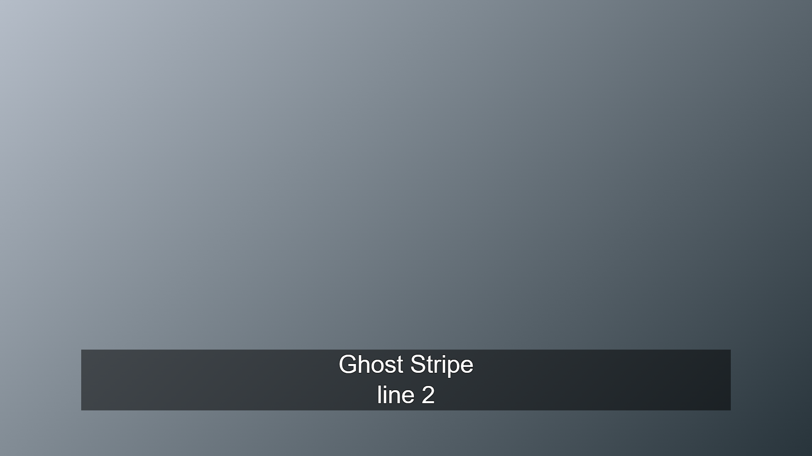


### subtitle 6 at begin=01:00:24.240


Unboxed but demonstrating 'background' color change on outlined text.

Retention of background colour may be important if the file is to be exported to teletext.


#### div XML

```
<div xml:id="6" region="R0" begin="01:00:24.240" end="01:00:28.240" style="d_default">
   <p style="p_font2"><span>Unboxed change to </span><span style="s_outlinered">red </span><span>then </span><span style="s_outlineblue">blue</span><span><br/></span><span>line 2</span></p>
  </div>
```
#### Resulting Image

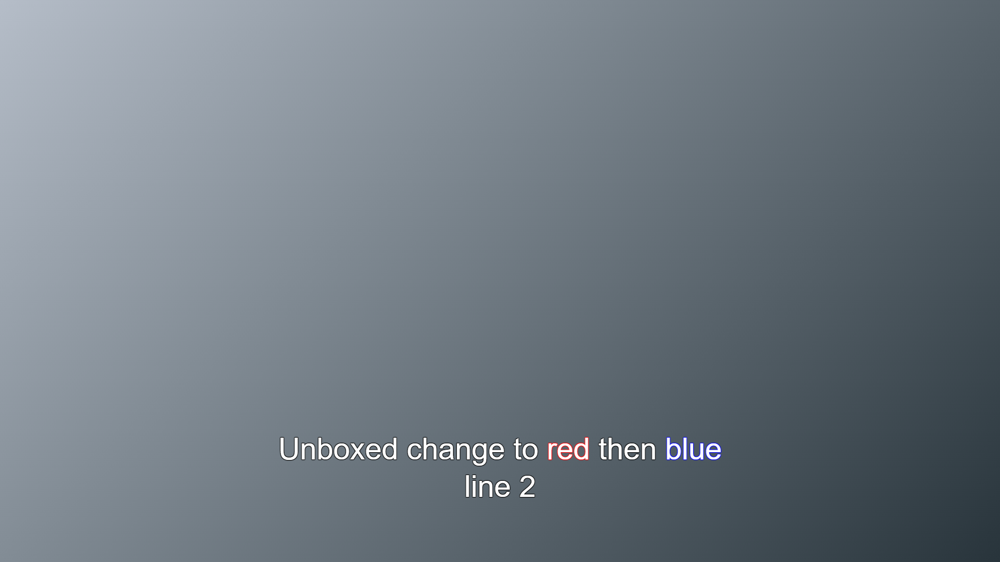


### subtitle 7 at begin=01:00:28.360


Solid box demonstrating change of background color.

Note that black outline is retained.  Comments?


#### div XML

```
<div xml:id="7" region="R0" begin="01:00:28.360" end="01:00:32.360" style="d_default">
   <p style="p_font2"><span style="ps_bg_boxedblack">Solid boxed change to </span><span style="ps_bg_boxedred">red </span><span style="ps_bg_boxedblack">then </span><span style="ps_bg_boxedblue">blue</span><span><br/></span><span style="ps_bg_boxedblack">line 2</span></p>
  </div>
```
#### Resulting Image

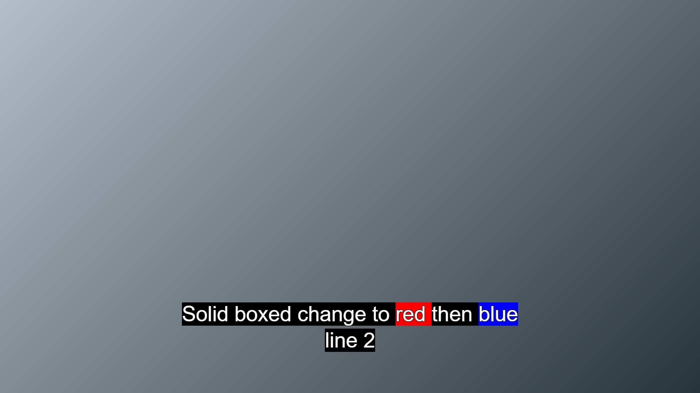


### subtitle 8 at begin=01:00:32.480


Ghost box demonstrating change of background color.

Note that black outline is retained.  Comments?


#### div XML

```
<div xml:id="8" region="R0" begin="01:00:32.480" end="01:00:36.480" style="d_default">
   <p style="p_font2"><span style="ps_bg_ghostboxedblack">Ghost boxed change to </span><span style="ps_bg_ghostboxedred">red </span><span style="ps_bg_ghostboxedblack">then </span><span style="ps_bg_ghostboxedblue">blue</span><span><br/></span><span style="ps_bg_ghostboxedblack">line 2</span></p>
  </div>
```
#### Resulting Image

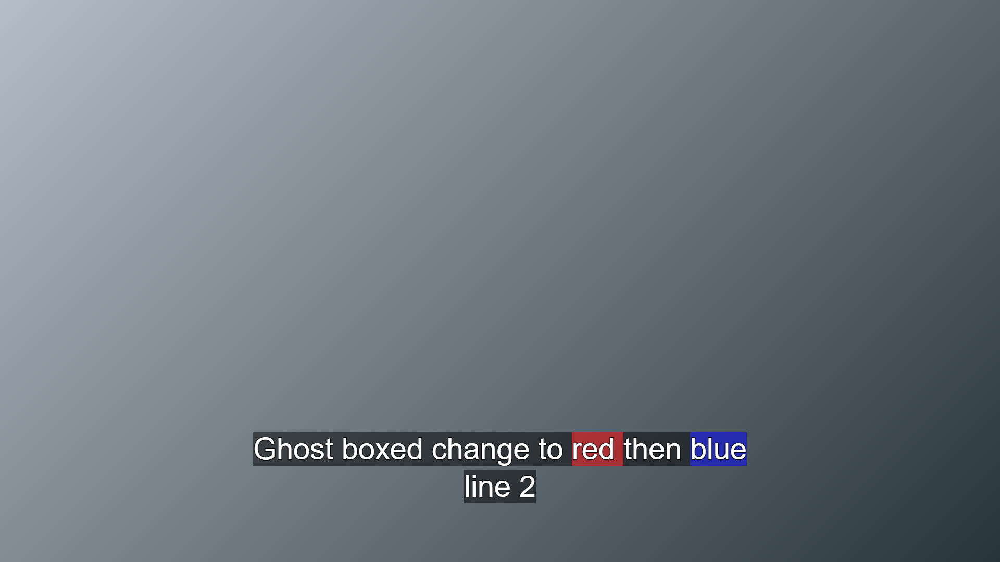


### subtitle 9 at begin=01:00:36.640


Solid Stripe demonstrating change of background color.

Note that black outline is retained.  Comments?


#### div XML

```
<div xml:id="9" region="R0" begin="01:00:36.640" end="01:00:40.640" style="d_default">
   <p style="p_font2 ps_bg_boxedblack"><span>Solid Stripe change to </span><span style="ps_bg_boxedred">red </span><span>then </span><span style="ps_bg_boxedblue">blue</span><span><br/></span><span>line 2</span></p>
  </div>
```
#### Resulting Image

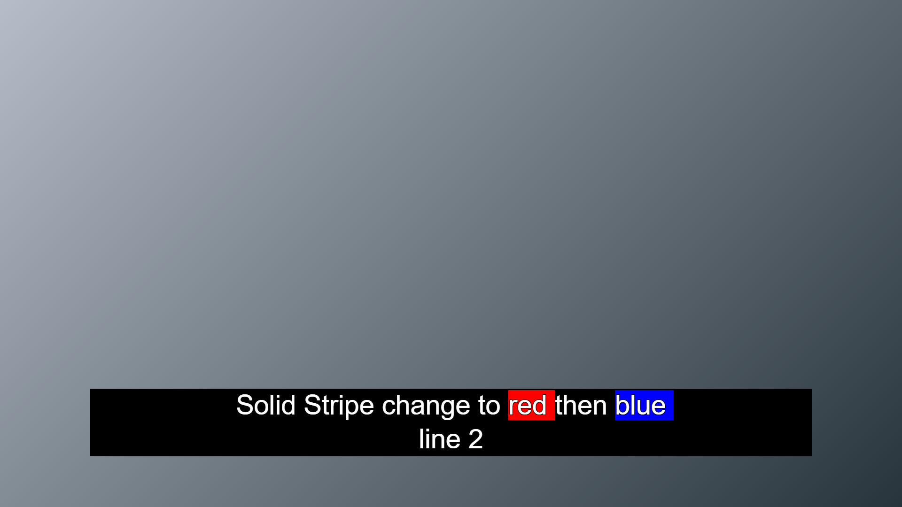


### subtitle 10 at begin=01:00:40.760


Ghost Stripe demonstrating change of background color.

Note how the changed background color spans have double the opacity of the black.

This is unavoidable because of the way boxing on `<p>` and `<span>` work in TTML.

Note that black outline is retained.  Comments?


#### div XML

```
<div xml:id="10" region="R0" begin="01:00:40.760" end="01:00:44.760" style="d_default">
   <p style="p_font2 ps_bg_ghostboxedblack"><span>Ghost Stripe change to </span><span style="ps_bg_ghostboxedred">red </span><span>then </span><span style="ps_bg_ghostboxedblue">blue</span><span><br/></span><span>line 2</span></p>
  </div>
```
#### Resulting Image

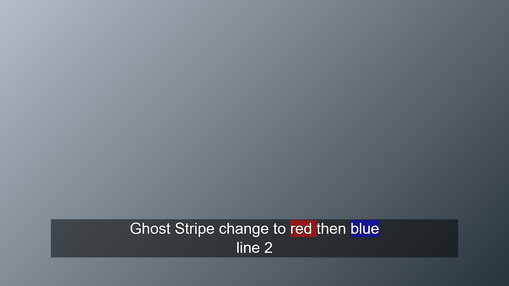


### subtitle 11 at begin=01:00:45.760


Solid black box with d_fillgap specified on `<div>`.


#### div XML

```
<div xml:id="11" region="R0" begin="01:00:45.760" end="01:00:48.760" style="d_default d_fillgap">
   <p style="p_font2"><span style="ps_bg_boxedblack">Solid Boxed - fillgap</span><span><br/></span><span style="ps_bg_boxedblack">line 2 descender:y ascender:Á</span></p>
  </div>
```
#### Resulting Image

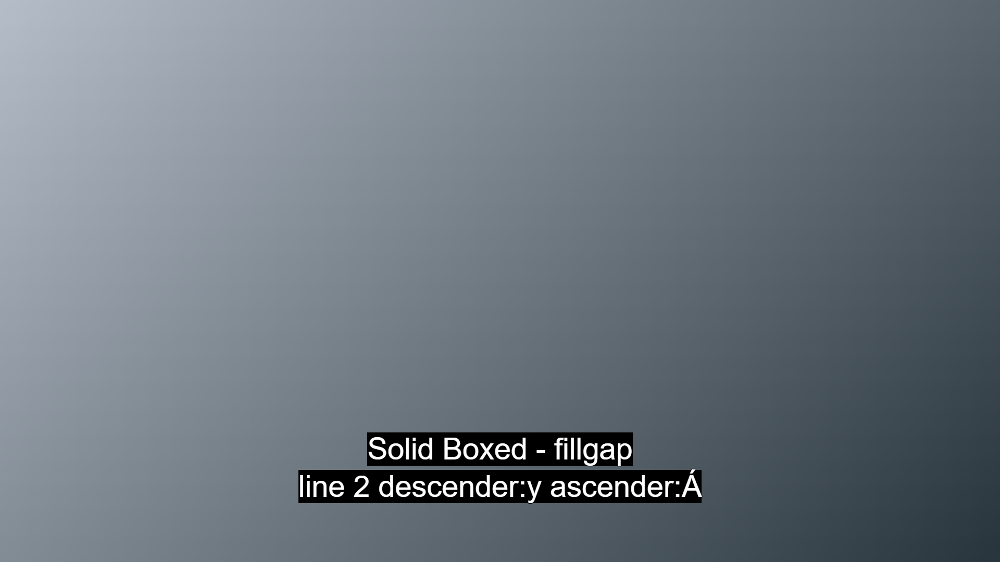


### subtitle 12 at begin=01:00:49.880


Ghost box with d_fillgap specified on `<div>`, but with a blank line in between the lines.

***The result is probably not desirable.***


#### div XML

```
<div xml:id="12" region="R0" begin="01:00:49.880" end="01:00:54.880" style="d_default d_fillgap">
   <p style="p_font2"><span style="ps_bg_ghostboxedblack">Ghost Boxed - fillgap</span><span><br/></span><span><br/></span><span style="ps_bg_ghostboxedblack">line 2</span></p>
  </div>
```
#### Resulting Image

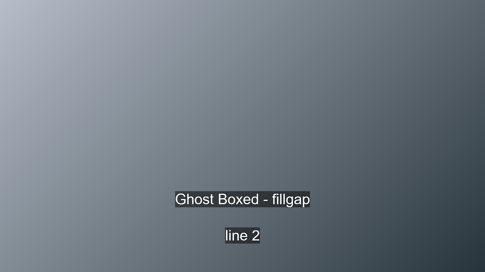


